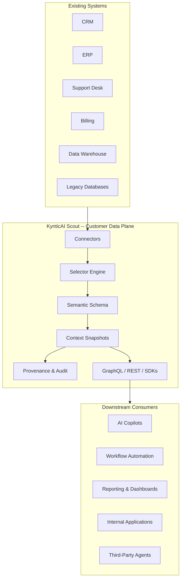
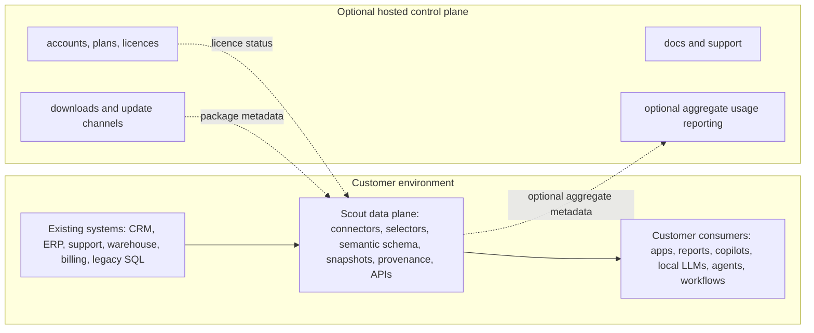
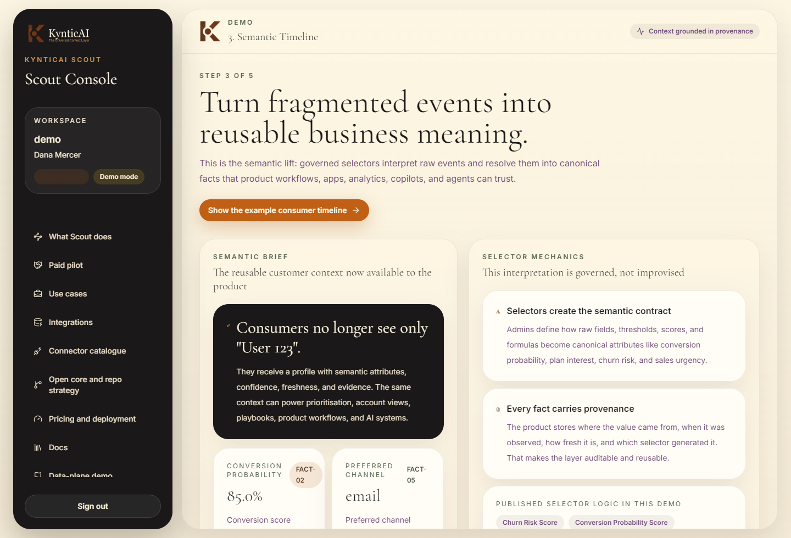

<p align="center">
  
</p>

<p align="center">
  <strong>KynticAI Scout</strong><br/>
  <em>KynticAI</em>
</p>

<p align="center">
  <a href="LICENSE"></a>
  <a href="https://github.com/PaulJMaddison/scout/releases"></a>
  
  
</p>

<p align="center">
  <strong>KynticAI Scout turns authorised company data into exact data items, relationships, attribution paths, and governed JSON for AI.</strong>
</p>

<p align="center">
  Scout is the open-core UCL data plane: it ingests company data through connectors or assisted imports, keeps exact items in the customer's environment, and prepares the relationship-set foundation used by Enterprise and customer-owned LLMs.
</p>

---

> **Naming and maturity note:** Workspace naming is defined in [source-of-truth-naming-map.md](../docs/source-of-truth-naming-map.md). This README describes the open-core Scout/UCL data plane and local demo; it does not claim complete self-serve SaaS maturity, vendor-certified connectors, live customer deployments, customer traction, or canonical Enterprise relationship-set/vector analysis.

## Docker Quick Start

Scout's recommended local evaluation path is fully Docker-contained: PostgreSQL, API, web console, telemetry, Prometheus, Grafana, and Tempo all start through Docker Compose. Customer/demo data, derived context, audit, and Data Protection keys live in local Docker volumes by default.

Prerequisites:

- Git
- Docker Desktop or Docker Engine with Docker Compose

```bash
git clone https://github.com/PaulJMaddison/scout.git
cd scout
sh ./scripts/start-scout-docker.sh --reset
```

<details>
<summary><strong>Windows (PowerShell)</strong></summary>

```powershell
git clone https://github.com/PaulJMaddison/scout.git
cd scout

.\scripts\start-scout-docker.ps1 -Reset
```

</details>

Then open [http://127.0.0.1:5173](http://127.0.0.1:5173) and log in:

| Field | Value |
|---|---|
| Tenant | `demo` |
| Email | `admin@scout.local` |
| Password | `DemoAdmin123!` |

The script builds and starts the stack, waits for readiness, logs in, checks that User `123` (`Avery Stone` at `Larkspur Logistics Group`) returns live context, validates/registers a standard connector, runs connector health, and sends local/LAN source-event webhooks.

When the self-test finishes it opens a local installation report in your browser and saves it at `.local/scout-install-report.html`. The report includes the verified checks, running URLs, detected LAN webhook URL, login details, first walkthrough, webhook guidance, and upgrade/stop commands. Use `-NoOpenReport` on PowerShell or `--no-open-report` on Unix shells if you want to generate the report without opening it.

What is running:

| Service | URL | Purpose |
|---|---|---|
| Scout web console | [http://127.0.0.1:5173](http://127.0.0.1:5173) | Admin console and investor walkthrough |
| Scout API | [http://127.0.0.1:5198](http://127.0.0.1:5198) | REST, GraphQL, auth, OpenAPI |
| OpenAPI / Scalar | [http://127.0.0.1:5198/api-docs](http://127.0.0.1:5198/api-docs) | Interactive API documentation |
| Grafana | [http://127.0.0.1:3000](http://127.0.0.1:3000) | Local observability (`admin` / `admin`) |
| Prometheus | [http://127.0.0.1:9090](http://127.0.0.1:9090) | Metrics |
| Tempo | [http://127.0.0.1:3200](http://127.0.0.1:3200) | Traces |

The API also listens on the host network interface. On a trusted LAN/VPN you can point another machine, workflow runner, CRM simulator, or n8n flow at:

```text
http://<host-ip>:5198/api/v1/events/source-system?tenantSlug=demo
```

The start scripts print the detected LAN web/API/webhook URLs. IP-only webhooks are fine for local workshops, private customer networks, VPNs, and static private IP installs. For public internet webhooks, put HTTPS with a stable DNS name or reverse proxy in front of the Docker API. From the web console, use **Data Sources** -> **Send source event** to test this path without setting up an external sender.

Use `docker compose ps` to inspect services and `docker compose logs -f api web` to follow application logs.

For contributor-only local runtime scripts (`.NET` + Node outside Docker), see the **[Getting Started Guide](docs/getting-started.md)**. Do not use the non-Docker path as the investor/customer sovereign install path.

---

## What Is Scout?

Scout is **customer-owned data-plane infrastructure for AI-enabled products**. It does not replace your CRM, ERP, support desk, or billing system. It sits beside those systems and creates governed exact data items, relationships, attribution paths, outcomes, provenance, and local APIs so that downstream consumers -- AI copilots, workflow engines, reporting tools, internal apps, local LLMs -- get trusted business meaning instead of disconnected records.

The flagship UCL workflow is: source systems -> UCL/Scout customer-owned data plane -> exact data items, relationships, attribution paths, comparable relationship sets, and outcomes -> Enterprise Rust engine/vector DB canonical analysis -> governed JSON with evidence, matches, ranked options, confidence, and caveats -> customer-owned LLM or KynticAI open-source/private LLM runtime -> text explanation of what to do next. This public repo demonstrates the open-core data-plane mechanics: source access, selectors, semantic facts, exact linked records, provenance, masking, audit, APIs, SDKs, basic fallback intelligence, Enterprise handoff artefacts, and a local demo/admin console. Private enterprise modules add the proprietary Enterprise Rust engine/vector DB, paid/private connectors, enterprise identity/governance, and customer-specific hardening where required.

For the seeded sales walkthrough, "authorised data" means subject-scoped data items approved for the customer data plane: normalised email address, CRM contact/account, account registration/profile, sales activity, email replies or meetings booked, web conversion and pricing-page events, open opportunities, support tickets, product usage summaries, billing health, and prior won/lost outcome signals. Those exact items, relationships, attribution paths, outcomes, citations, local JSON artefacts, connector credentials, selectors, facts, snapshots, and audit logs stay in the customer-controlled environment by default.

Scout Cloud is optional commercial/control-plane support only. It can manage accounts, licences, downloads, support access, update channels, and optional aggregate usage metadata; it is not required to run the data plane and must not receive raw customer operational data or derived relationship intelligence by default.
Clarity and Importance are separate KynticAI products. They are not required for UCL/Scout, Enterprise, or Cloud.

### Key Capabilities

| Capability | Description |
|---|---|
| **Dual-Database Architecture** | Operational source data separated from semantic context data |
| **Selector Engine** | Admin-authored rules that turn raw fields into canonical semantic attributes |
| **Context Snapshots** | Reusable business profiles with confidence, freshness, and provenance |
| **GraphQL + REST APIs** | Every context surface available through both query styles |
| **TypeScript & .NET SDKs** | Typed client libraries for integration teams |
| **Relationship-Set Foundation** | Local/customer-data-plane exact linked records, relationships, attribution-path evidence, outcomes, basic fallback-only signals, citations, masking decisions, and governed JSON artefacts for approved consumers -- Scout does not need to call an AI model and does not claim canonical Enterprise analysis |
| **Connector Framework** | Generic SQL, REST, CSV, mock connectors + extension points for enterprise |
| **Audit & Provenance** | Every read, recompute, and context access is traceable |
| **Blueprint Import** | AI-generated configuration (from Codex, Claude, ChatGPT) validated and imported |
| **Admin Console** | React-based UI for data sources, selectors, schemas, context viewer, and audit |

---

## Architecture



**Customer data stays in the customer's environment.** The data plane owns source access, connector credentials, selectors, exact linked records, relationships, attribution paths, outcomes, facts, snapshots, local JSON artefacts, provenance, audit, and APIs. An optional Cloud/control-plane relationship manages only commercial metadata such as accounts, licences, downloads, support access, update channels, and optional aggregate usage. Cloud aggregate usage payloads are limited to control-plane metadata such as tenant identifiers, package version, feature counters, status, timestamps, and event metadata; they must not carry raw records, context facts or snapshots, evidence packs, prompts, generated content, recommendations, citation IDs, weighted signals, or per-entity relationship metadata.



---

## Screenshot Gallery

| Executive demo | Overview dashboard |
| --- | --- |
|  |  |

| Data sources | Selector builder |
| --- | --- |
|  |  |

| Schema registry | Customer context viewer |
| --- | --- |
|  |  |

| Scout event timeline | AI-assisted onboarding |
| --- | --- |
|  |  |

| Example consumer: Intelligent Sales Support | Audit log |
| --- | --- |
|  |  |

| Licence and deployment status |
| --- |
|  |

---

## Tech Stack

| Layer | Technologies |
|---|---|
| **Frontend** | React 19, Vite, TypeScript, TanStack Router, TanStack Query, Tailwind CSS |
| **Backend** | ASP.NET Core (.NET 10), Hot Chocolate GraphQL, EF Core, FluentValidation, OpenTelemetry |
| **Data** | Dual-database: operational source DB + semantic context DB (SQLite local / PostgreSQL production) |
| **APIs** | GraphQL, REST v1, TypeScript SDK, .NET SDK, governed context and relationship JSON packages |

---

## Demo Walkthrough

The seeded demo includes synthetic realistic B2B SaaS data: 2 tenants, 30 accounts, 80+ contacts, 200 sales activities, 560 product usage rows, 100 support tickets, email/web engagement, billing status, account registration/profile fields, open opportunities, and prior won/lost outcome signals.

For first-run speed, the Docker demo precomputes governed context snapshots for the guided walkthrough records listed below. The broader synthetic operational dataset remains available for connector, selector, relationship, and API exploration.

The demo relationship JSON is intentionally exact and inspectable. It links the authorised records in the customer data plane, carries citation IDs and masking decisions, shows deterministic relationships such as email-to-contact and contact-to-account, includes attribution-path evidence and similar won/lost patterns where present, and produces basic fallback-only signals plus a grounded recommended next action for a customer-owned consumer. The optional Cloud aggregate usage payload for the same flow contains only control-plane usage metadata, not the derived relationship intelligence.

The primary walkthrough remains B2B SaaS revenue/customer success. A separate deterministic proof fixture at `samples/relationship-intelligence/exact-data-proof.synthetic.json` also covers ecommerce conversion, support churn, recruitment, finance retention, and healthcare operations using synthetic records only. Those cross-domain fixtures are proof artefacts for local tests and docs; they are not customer production deployments, live customer data, vendor certification, or traction claims.

**Best demo record:** `demo` tenant / `User 123` / `Avery Stone` / `Larkspur Logistics Group`

### Recommended Path

1. **Executive Demo** (`/demo`) -- the product story: existing systems stay, Scout creates semantic meaning
2. **Legacy Signals / Semantic Timeline / Example Consumer Timeline / ROI** -- narrative for decision-makers
3. **Customer Context** for User 123 -- summary, facts, confidence, snapshots, interpretation timeline
4. **Data Sources / Connector Lab** (`/data-sources`) -- choose an executable standard connector, validate/register it, run health, and send a safe source event as a new data item
5. **Connector Catalogue** (`/admin/connectors`) -- separate executable open-core connectors from enterprise/SaaS placeholder listings
6. **Bootstrap Studio** -- show how AI tools generate import blueprints (validated without calling AI APIs)
7. **Selector Builder** -- preview how admin logic turns raw fields into canonical attributes
8. **Intelligent Sales Support** -- relationship JSON, cited facts, attribution-path evidence, recommended next action, and generated outreach direction
9. **Audit Log / Webhook Events** -- governance: reads, recomputes, source events, and access are traceable

The Docker demo's executable standard connectors are generic SQL/PostgreSQL, generic REST API with static-response preview support, CSV upload rows, mock CRM, mock billing, mock support, mock payload/signal, in-memory inventory, and the connector authoring template. Salesforce, HubSpot, Dynamics, Snowflake, BigQuery, Zendesk, NetSuite, email, chat, calendar, analytics, work-management, and knowledge-system entries remain catalogue placeholders unless implemented in a private/customer package.

### Demo Credentials

| Tenant | Email | Password |
|---|---|---|
| `demo` | `admin@scout.local` | `DemoAdmin123!` |
| `demo` | `rep@scout.local` | `DemoSales123!` |
| `summit` | `admin@summit.scout.local` | `SummitAdmin123!` |
| `summit` | `rep@summit.scout.local` | `SummitSales123!` |

### Best Demo Records

| Tenant | User ID | Name | Company |
|---|---|---|---|
| `demo` | `123` | Avery Stone | Larkspur Logistics Group |
| `demo` | `126` | Priya Nwosu | Brindle Care Network |
| `demo` | `129` | Marcus Bell | Quartz Legal Systems |
| `summit` | `132` | Elena Petrov | Emberforge Robotics |
| `summit` | `135` | Calvin Reese | Willowbank Finance Group |

---

## API Examples

### REST -- User context lookup

```bash
# Get a machine token
curl -X POST http://127.0.0.1:5198/api/auth/token \
  -H "Content-Type: application/json" \
  -d '{"grantType":"client_credentials","clientId":"crm-service","clientSecret":"replace-me","scope":"context:read context:write"}'

# Read user context
curl "http://127.0.0.1:5198/api/v1/context/users/123?tenantSlug=demo" \
  -H "Authorization: Bearer <token>"

# Queue recomputation
curl -X POST "http://127.0.0.1:5198/api/v1/context/recompute?tenantSlug=demo" \
  -H "Authorization: Bearer <token>" \
  -H "Content-Type: application/json" \
  -d '{"externalUserId":"123","triggeredBy":"crm-webhook"}'
```

### GraphQL -- User context lookup

```graphql
query {
  userContext(input: { tenantSlug: "demo", externalUserId: "123" }) {
    fullName
    companyName
    summary
    overallConfidence
    facts { attributeKey confidence explanation }
  }
}
```

### TypeScript SDK

```typescript
import { createScoutClient } from '@kynticai/scout-sdk'

const scout = createScoutClient({
  baseUrl: 'http://127.0.0.1:5198',
  accessToken: process.env.SCOUT_TOKEN,
})

const context = await scout.users.getContext('demo', '123')
console.log(context?.fullName, context?.overallConfidence)

const facts = await scout.facts.getForUser('demo', '123', { attributeKey: 'health' })
```

See the [TypeScript SDK README](packages/typescript/scout-sdk/README.md) and [Public API Contract](docs/public-api-contract.md) for the full reference.

---

## REST API v1

Systems that do not want GraphQL can use the deployment-oriented REST surface under `/api/v1`. Core endpoints:

| Method | Endpoint | Description |
|---|---|---|
| `GET` | `/api/v1/context/users/{id}` | User context lookup |
| `GET` | `/api/v1/context/accounts/{id}` | Account context lookup |
| `GET` | `/api/v1/context/users/{id}/facts` | Semantic fact lookup with filters |
| `GET` | `/api/v1/context/snapshots/{id}` | Context snapshot retrieval |
| `POST` | `/api/v1/context/users/{id}/ai-safe-context-package` | Governed context package |
| `POST` | `/api/v1/intelligence/next-action` | Exact linked records, relationships, attribution-path evidence, Scout fallback signals, Enterprise handoff JSON, and recommended next action |
| `POST` | `/api/v1/context/recompute` | Queue recomputation |
| `POST` | `/api/v1/selectors/preview` | Selector preview |
| `POST` | `/api/v1/selectors/validate` | Selector validation |
| `GET` | `/api/v1/connectors/catalogue` | Connector catalogue |
| `GET` | `/api/rest/connectors/plugins` | Executable connector plugin metadata |
| `POST` | `/api/rest/connectors/validate` | Validate connector configuration |
| `POST` | `/api/rest/connectors/register` | Register or update a connector-backed data source |
| `POST` | `/api/rest/connectors/health` | Run connector health check |
| `GET` | `/api/v1/semantic-attributes` | Semantic attribute registry |
| `GET` | `/api/v1/audit-events` | Audit event log |
| `POST` | `/api/v1/events/source-system` | Source-system event ingestion |
| `POST` | `/api/v1/blueprints/import` | Blueprint import |
| `POST` | `/api/v1/api-clients` | Create API client |

All endpoints support JWT bearer tokens, persisted API clients, `X-Request-Id` correlation IDs, and OpenAPI documentation at `/swagger` when `Platform__EnableOpenApi=true`.

---

## Documentation

| Document | Description |
|---|---|
| [Public API Contract](docs/public-api-contract.md) | GraphQL, REST, SDK, auth, pagination, error contracts |
| [Connector Plugin Model](docs/connector-plugin-model.md) | How to build and register connectors |
| [Connector Catalogue](docs/connector-marketplace.md) | Available connectors and enterprise placeholders |
| [Connector Authoring Guide](docs/connector-authoring.md) | Step-by-step guide to writing a new connector |
| [Connector Test Harness](docs/connector-test-harness.md) | Local-only validation tool for connector authors |
| [Connector Manifest Validator](docs/connector-manifest-validator.md) | Public manifest schema and CLI |
| [Customer Data Plane](docs/customer-data-plane.md) | Where data lives and what the customer owns |
| [Integration Layer](docs/integration-layer.md) | How source systems and consumers integrate |
| [Control Plane / Data Plane](docs/control-plane-data-plane.md) | Architecture split between hosted and customer-owned |
| [Cloud Commercial Control Contract](docs/cloud-commercial-control.md) | Scout boundary for optional Cloud licences, entitlements, downloads, support, and aggregate usage |
| [Webhook Events](docs/webhook-events.md) | Provider-neutral event ingestion contract |
| [Product Positioning](docs/product-positioning.md) | Marketing messaging and buyer narrative |
| [Buyer FAQ](docs/buyer-faq.md) | Answers for CEOs, CTOs, product leaders, and architects |
| [SDK Development](docs/sdk-development.md) | Guide for TypeScript and .NET SDK contributors |
| [Open Core Boundary](docs/open-core-boundary.md) | What belongs in the public repo vs. enterprise |
| [Enterprise Extension Points](docs/enterprise-extension-points.md) | How paid modules extend the open core |
| [Roadmap](docs/roadmap.md) | Planned features and milestones |
| [ADR: GraphQL Semantic Scout](docs/adr/0001-graphql-semantic-scout.md) | Architecture decision record |

---

## Runtime Modes

The backend supports three explicit modes:

| Mode | Description |
|---|---|
| `LocalDemo` | Default. SQLite, fictional seed data, React demo. |
| `BackendOnly` | API-first mode for GraphQL, REST, SDK, and service-client work. |
| `SaaS` | Hosted/control-plane-compatible PostgreSQL mode. This is a runtime mode name, not a claim that Scout is complete self-serve SaaS. |

Use `/api/platform/config` to inspect the effective mode and enabled feature flags at runtime.

---

## Backend-Only Developer Quick Start

Run the API without the React frontend when contributing to the source tree. This path uses repo-local or machine-local runtimes and is not the recommended investor/customer self-contained install.

```bash
sh ./scripts/setup-backend.sh
sh ./scripts/start-backend.sh
```

Optionally seed demo data: `sh ./scripts/setup-backend.sh --seed-demo-data`

Optional PostgreSQL mode: `sh ./scripts/setup-backend.sh --use-docker`

---

## Deployment

### Docker

```bash
docker build -f src/KynticAI.Scout.Api/Dockerfile -t scout-api .
docker run --rm -p 8080:8080 \
  -e Platform__Mode=BackendOnly \
  -e Database__Provider=Postgres \
  -e "ConnectionStrings__Scout=<postgres-connection-string>" \
  -e "ConnectionStrings__CustomerOps=<postgres-connection-string>" \
  -e "Auth__SigningKey=<48+-byte-random-secret>" \
  -e DataProtection__KeyRingPath=/var/lib/scout/data-protection-keys \
  -e DataProtection__RequirePersistentKeys=true \
  -v scout-data-protection-keys:/var/lib/scout/data-protection-keys \
  scout-api
```

### Hosted PostgreSQL

See [docs/hosted-deployment.md](docs/hosted-deployment.md) and [render.yaml](render.yaml) for a Render Blueprint.

### Production Checklist

Use the [Production Install Checklist](docs/production-install-checklist.md) before any customer-facing deployment.

---

## Testing

Use `./.dotnet/dotnet` if you ran `setup-demo.sh` and do not have a global .NET 10 SDK.

```bash
# Backend unit tests
dotnet test tests/KynticAI.Scout.UnitTests/KynticAI.Scout.UnitTests.csproj
dotnet test tests/KynticAI.Scout.Sdk.Tests/KynticAI.Scout.Sdk.Tests.csproj

# Frontend (from apps/web)
cd apps/web
npm run lint
npm test
npm run build

# TypeScript SDK (from packages/typescript/scout-sdk)
cd packages/typescript/scout-sdk
npm test
```

Safe validation should produce successful .NET restore/build output, passing backend unit and SDK tests, clean frontend lint/test/build output, and passing TypeScript SDK tests. Browser proof and production-style rehearsal paths are opt-in. Use `KYNTIC_RUN_BROWSER_TESTS=1 npm run test:e2e` for Playwright, and set `KYNTIC_RUN_EXTERNAL_DOTNET_TESTS=1` before Docker/PostgreSQL or enterprise connector smoke rehearsals. See [LOCAL_VALIDATION.md](LOCAL_VALIDATION.md) for the full local-safe command set, required variables, and known partial proofs.

---

## Reset & Restart

```bash
sh ./scripts/start-scout-docker.sh             # rebuild if needed and start all Docker services
sh ./scripts/start-scout-docker.sh --no-build  # start existing images
sh ./scripts/start-scout-docker.sh --reset     # delete Scout Docker volumes, reseed, and start clean
docker compose down                            # stop services, keep data volumes
docker compose down -v                         # stop services and delete Scout local data volumes
```

PowerShell equivalents:

```powershell
.\scripts\start-scout-docker.ps1
.\scripts\start-scout-docker.ps1 -NoBuild
.\scripts\start-scout-docker.ps1 -Reset
docker compose down
docker compose down -v
```

## Upgrade

For a local demo/evaluation upgrade:

```bash
git pull
sh ./scripts/start-scout-docker.sh
```

That rebuilds changed images and keeps existing Docker volumes. Use `--reset` only when you intentionally want a clean demo database.

For a production-style customer data plane, keep `Bootstrap__SeedDemoData=false`, back up both PostgreSQL databases and the Data Protection key ring, run migrations as a controlled job, then roll the API/web images forward. See [Production Install Checklist](docs/production-install-checklist.md) and [Hosted PostgreSQL Deployment](docs/hosted-deployment.md).

---

## Open Core Model

This repository is the **public open-source core** of KynticAI Scout. It is designed to be useful on its own: teams can run it locally, explore the APIs and SDKs, test integration patterns, and build context consumers without needing paid features.

# Commercial & Enterprise Solutions

For organisations that need private connectors, managed deployment support, stronger governance controls, Enterprise Rust engine/vector DB analysis, or production support, KynticAI scopes commercial Scout packages around this open-source core. Formal SLA or customer-production commitments require a signed support process, named owners, and deployment evidence.

## The Enterprise Advantage

### High-Scale Runtime Options
Implementation-specific runtime components for high-volume data planes and latency-sensitive customer environments.

### Private Deployment Support
Support for private cloud, single-tenant, or air-gapped on-premise deployments where customer operational data remains inside the agreed customer-controlled perimeter.

### Scout Enterprise Connectors
Scoped paid/private connector modules and adapter work for enterprise systems such as CRM, ERP, warehouse, support, email, chat, analytics, work management, and knowledge platforms. These are not vendor-certified turnkey connectors unless a specific customer/vendor path has passed the required validation.

### Architectural Governance
Private modules and extension points for SSO/SCIM integration, granular RBAC (Role-Based Access Control), and compliance/audit workflows where a customer deployment requires them.

### Contextual Intelligence
Optional private modules for the proprietary Enterprise Rust engine/vector DB, relationship-set analysis, attribution-path analysis, outcome-pattern matching, and governed JSON handoff that build on the exact data items managed by Scout.

### Mission-Critical Support
Implementation-led paid pilots with delivery support. Formal commercial SLAs for production-grade environments are a contracted support/process commitment, not an automatic README claim.

---

# Access & Licensing

## Scout Cloud & Managed Hosting
Optional commercial/control-plane package for account workflows, licence operations, downloads, support access, update-channel support, and aggregate usage metadata. Cloud is not required for the customer-owned data plane and must not receive next-action relationship/evidence packages, recommendations, citations, weighted signals, attribution paths, relationship sets, or per-entity relationship metadata by default.

## Scout Enterprise Features
Commercial package for proprietary connectors, identity integrations, deployment packs, governance modules, and scoped production support. Connector and support claims must be validated per customer/vendor environment.

See [docs/open-core-boundary.md](docs/open-core-boundary.md) and [docs/enterprise-extension-points.md](docs/enterprise-extension-points.md) for the detailed boundary.

> **Enterprise enquiries:** [paul@kynticai.com](mailto:paul@kynticai.com) | [kynticai.com](https://kynticai.com)

---

## Releases

Scout uses coordinated [semantic versioning](https://semver.org/) across all three repositories (open-source, enterprise, cloud). Every release is tagged with the same `vX.Y.Z` version.

| Resource | Description |
|---|---|
| [Release Process](docs/releases/release-process.md) | Full release workflow, checklists, and hotfix process |
| [Cross-Repo Changelog](docs/releases/CHANGELOG.md) | Consolidated changelog across all three repos |
| [GitHub Releases](https://github.com/PaulJMaddison/scout/releases) | Published releases with auto-generated notes |

### Release Scripts

```bash
# Preview a version bump (no files modified)
./scripts/bump-version.sh 2.8.0 --dry-run

# Preview a tag creation (no tag created)
./scripts/tag-release.sh v2.8.0 --dry-run
```

See [docs/releases/release-process.md](docs/releases/release-process.md) for the complete step-by-step release guide.

---

## Contributing

We welcome contributions! Please read [CONTRIBUTING.md](CONTRIBUTING.md) for guidelines on development setup, code style, and the pull request process.

## Security

See [SECURITY.md](SECURITY.md) for our security policy and responsible disclosure process.

## License

KynticAI Scout is released under the [MIT License](LICENSE).

Copyright (c) 2026 KynticAI
