# Universal Context Layer

Universal Context Layer turns existing business data into trusted semantic context that customer-owned AI tools, workflows, apps, reports, and agents can use.

Release: `2.7.0`
License: [MIT](LICENSE)
Contributing: [CONTRIBUTING.md](CONTRIBUTING.md)
Security: [SECURITY.md](SECURITY.md)

UCL is context infrastructure for AI-enabled products, workflows, apps, reports, and agents. It does not replace your CRM, ERP, support desk, warehouse, product database, billing system, spreadsheets, or legacy databases. It sits beside those systems and creates the missing semantic layer above them.

We do not build the brain. We build the nervous system: the governed customer data plane that carries trusted business context from existing systems to the customer's own AI tools, workflows, reports, apps, and agents.

## Current Maturity

- Public open-core product foundation with a working local SQLite demo, self-hosted data plane, admin console, REST/GraphQL APIs, SDK scaffolds, and generic connector contracts.
- Customer operational data can remain local by default; UCL does not need to own the customer's AI provider or raw systems of record.
- Not a self-serve hosted commercial SaaS product in this public repository.
- Not a paid enterprise connector pack in this public repository.
- Paid enterprise and cloud/control-plane implementations are commercial/private offerings that are intentionally not included in this open-source repo.
- Public enterprise connector entries are placeholders and interfaces only. Real implementations live in private enterprise packages, use metadata-only ingestion by default for communication and knowledge sources, and require explicit customer opt-in before message bodies, document bodies, or attachments are processed.

## First Paid Pilot Path

The current sellable motion is a supported paid pilot, not a fully hands-off SaaS signup. A customer can run the UCL data plane in their own environment, keep operational data local, and use UCL to create governed context for their own AI tools, applications, reports, and workflows.

Use these documents before offering a first commercial pilot:

- [First paid pilot one-pager](docs/first-paid-pilot-one-pager.md)
  A buyer-friendly summary of the supported pilot offer, scope, outcomes, pricing anchors, and commercial proof.
- [Paid pilot offer](docs/paid-pilot.md)
  Explains the first commercial package, buyer profile, pilot workflow, deliverables, boundaries, and success criteria.
- [Buyer FAQ](docs/buyer-faq.md)
  Answers CEO, CTO, product leader, and enterprise architect questions without overclaiming SaaS or paid connector readiness.
- [Customer data plane](docs/customer-data-plane.md)
  Explains where operational data, selectors, facts, snapshots, provenance, audit, APIs, and optional control-plane metadata belong.
- [Public API contract](docs/public-api-contract.md)
  Documents GraphQL, REST, SDK, auth, context package, selector, audit, pagination, scoping, and error response contracts.
- [Integration layer](docs/integration-layer.md)
  Explains how SQL, CRM, support, billing, telemetry, email metadata, web events, legacy .NET applications, reports, workflows, and customer-owned AI tools integrate with UCL.
- [Connector catalogue](docs/connector-marketplace.md)
  Labels public generic examples, paid enterprise implementations, planned connectors, placeholders, and customer-specific connector work.
- [Static GitHub Pages demo](docs/static-github-pages-demo.md)
  Shows how the backend-free public demo tells the product story under a GitHub Pages base path.
- [Production install checklist](docs/production-install-checklist.md)
  Covers secrets, PostgreSQL, demo fallback, Data Protection keys, connector credentials, privacy, audit, backups, logs, and support.
- [Paid pilot end-to-end rehearsal](docs/paid-pilot-end-to-end-rehearsal.md)
  Walks the local cross-repo commercial flow without real hosting, payment credentials, production licence keys, or customer data.
- [M2M and webhook smoke](docs/m2m-and-webhook-smoke.md)
  Proves local machine-client and signed event seams before customer integration work.
- [Licence install rehearsal](docs/licence-install-rehearsal.md)
  Documents the local cloud licence download to data-plane file path check.
- [Commercial readiness summary](docs/commercial-readiness-summary.md)
  States what is ready to show, what is ready for paid pilot conversations, what remains, and what claims not to make yet.
- [Release and hosting alignment](docs/release-and-hosting-alignment.md)
  Keeps public hosting aligned to reviewed `main`/tag releases rather than accidental feature branch deployment.

Keep the phrase "customer data plane" central in sales and technical discussions. It is the clearest way to explain that UCL can create semantic context without requiring the customer to send raw operational data to a hosted SaaS by default.

## Customer Data Plane

The customer data plane is the part of UCL that runs beside the customer's systems. It owns connector configuration, source access, selectors, semantic schema, context facts, context snapshots, provenance, audit logs, API clients, and local operational configuration.

In a paid pilot, the customer data plane is the product being proved. It lets the customer keep operational data under their control while downstream systems consume trusted context through REST, GraphQL, SDKs, or internal service calls.

The future hosted control plane should manage commercial operations such as accounts, billing, licences, downloads, support, update channels, entitlement metadata, customer contacts, and optional aggregate usage. It should not require raw customer records, connector credentials, context facts, prompt context packages, message bodies, documents, attachments, or analytics event payloads by default.

## Anonymised ERP Platform Pattern

A recent ERP platform engagement showed the pattern clearly: the customer did not need to rip out legacy systems. We created a semantic context layer over existing operational data so the new web platform and AI-enabled workflows could consume business meaning rather than raw records.

That engagement involved the same architectural pattern UCL productises: legacy databases and fragmented business records stayed in place, while a context layer made customer, account, workflow, and operational context reusable for the new platform. It is described as an [anonymised implementation pattern](docs/anonymised-erp-platform-pattern.md), not as a named case study or customer endorsement.

## What This Is Not Yet

UCL is sellable today as a supported paid pilot and hybrid self-hosted context infrastructure product. It is not yet:

- a complete self-serve SaaS signup
- a live hosted billing product
- a hosted account-management portal
- a production licence portal
- a public package containing paid enterprise connectors
- a vendor-certified connector suite
- a replacement for the customer's AI stack

The open-source core is useful on its own, and paid implementation support can make the first customer onboarding practical. Fully managed control-plane operations remain future/private cloud work.

## Production Readiness

Use the [production install checklist](docs/production-install-checklist.md) before any customer-facing pilot. At minimum, production-style deployments need PostgreSQL, persistent Data Protection keys, a strong `Auth__SigningKey`, scoped API clients, audit logging, backup and restore testing, customer-approved connector credential storage, and demo seed data disabled.

## Demo Fallback Warning

`VITE_DEMO_FALLBACK=true` is for local demos only. Customer and production-style deployments must use `VITE_DEMO_FALLBACK=false`. Demo fallback must never hide API failures or present mock data as customer data.

It is built to make a few points obvious in a few clicks:

- companies already have valuable customer data spread across legacy CRM, usage, billing, support, and web systems
- most teams cannot replatform those systems before they need better automation, reporting, product workflows, or AI features
- raw IDs, stale tables, and disconnected records are a poor interface for software that needs business meaning
- a reusable semantic context layer turns fragmented operational signals into trusted facts
- context facts carry confidence, freshness, provenance, masking status, and audit history
- downstream consumers can bring their own AI tools, models, agents, copilots, internal products, reporting tools, or workflow automation

It is meant to work for business and technical decision-makers alike:

- business leaders can see the revenue and workflow impact
- CEOs and product leaders can see how existing data becomes useful across several customer workflows
- CTOs can see the integration, governance, API, and rollout story
- integration teams can see how source systems stay in place while downstream consumers get a cleaner contract

## UCL does not need to own your AI

UCL is not another AI app. It is the layer that makes a company's own AI apps, internal workflows, reporting tools, and product experiences more useful.

Customers can bring their own AI stack. That might be an internal copilot, a CRM AI feature, a workflow automation service, a model-hosting platform, a third party agent, or a product feature that does not use AI at all. UCL supplies governed business context: semantic facts with evidence, confidence, freshness, provenance, masking, and auditability.

Possible consumers include:

- internal copilots
- CRM AI features
- support automation
- customer success tools
- product onboarding
- marketing personalisation
- reporting and decision systems
- workflow automation
- third party AI agents
- internal business applications

The AI sales playground in this repository is one example consumer of the context layer. It is useful for showing how grounded context improves a sales support workflow, but it is not the required product architecture. The same context layer can power support, onboarding, reporting, customer success, product automation, marketing personalisation, internal copilots, and non-AI decision systems.

AI fails when it only sees raw IDs, stale tables, or disconnected records. UCL gives downstream systems business meaning, evidence, confidence, and guardrails.

## Why This Demo Matters

This repo deliberately separates two databases:

- `customer_ops_db`
  This is the operational source-of-truth estate. It holds accounts, contacts, users, subscriptions, products, plans, opportunities, sales activity, email engagement, support tickets, product usage summaries, billing metrics, and web conversion events.
- `context_layer_db`
  This is the semantic context platform. It holds tenants, data sources, selector definitions, selector execution history, semantic attribute definitions, context snapshots, context facts, prompt templates, agent runs, audit events, recompute jobs, and provenance metadata.

The application reads from `customer_ops_db`, applies admin-defined selector logic, and writes canonical semantic facts into `context_layer_db`.

That is the value of the reusable integration and context layer:

- the customer keeps existing operational systems
- the semantic contract becomes reusable across product features, workflows, analytics, copilots, and agents
- downstream systems get grounded, explainable inputs instead of brittle point-to-point joins
- AI is one consumer, not the owner of the architecture

## What You Can Show In The Demo

- an executive-friendly landing experience at `/demo`
- a five-step walkthrough for business and technical decision-makers
- a cross-system event timeline that shows how raw operational signals become semantic meaning
- Bootstrap Studio showing how tools like Codex or Claude can analyse source systems, generate a `ContextLayerBlueprint`, and import governed selectors, attributes, data sources, and prompt templates
- a data source view that reinforces the operational system boundary
- a connector catalogue page that shows open-core connectors and clearly labels enterprise/vendor connectors as non-executable paid/private placeholders
- a selector builder showing how raw fields become semantic attributes
- a schema registry for the canonical business vocabulary
- a customer context viewer where `User 123` becomes a 360 commercial profile
- an example consumer called Intelligent Sales Support that generates a grounded outreach strategy, personalised email, and follow-up recommendations
- an audit log showing that reads, recomputes, and context access are traceable
- a responsive admin experience verified across laptop, desktop, and mobile viewports

## Screenshot Gallery

These screenshots are captured from the current repo UI running locally in the default SQLite demo mode. They use the seeded `demo` tenant and the Larkspur Logistics Group `User 123` walkthrough.

| Executive demo | Overview |
| --- | --- |
| 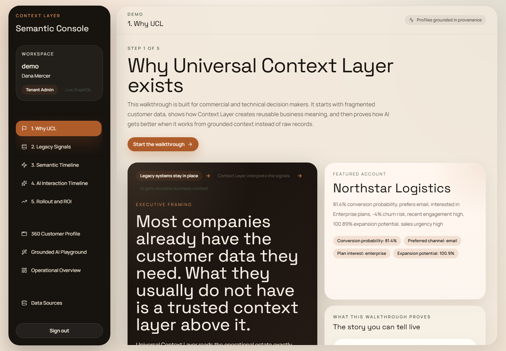 | 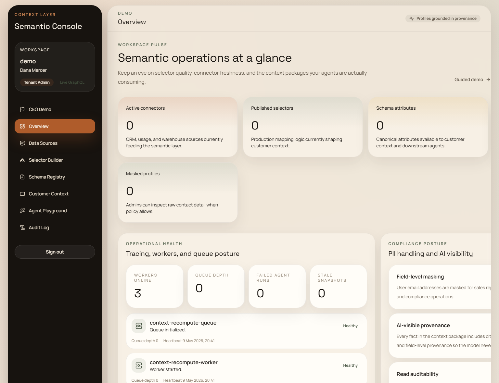 |

| Data sources | Selector builder |
| --- | --- |
| 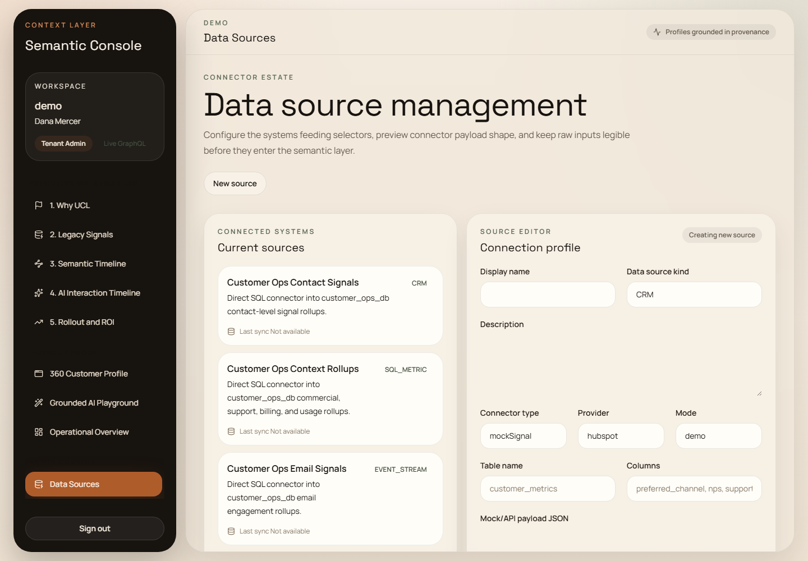 | 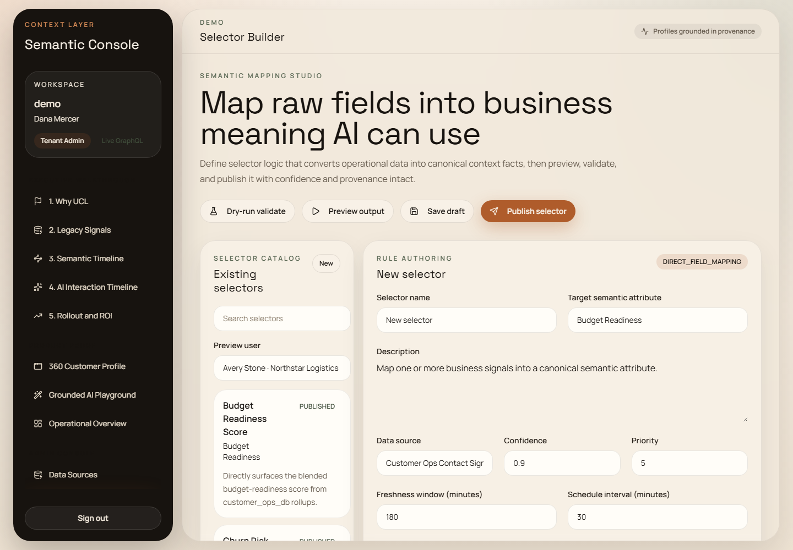 |

| Schema registry | Customer context viewer |
| --- | --- |
| 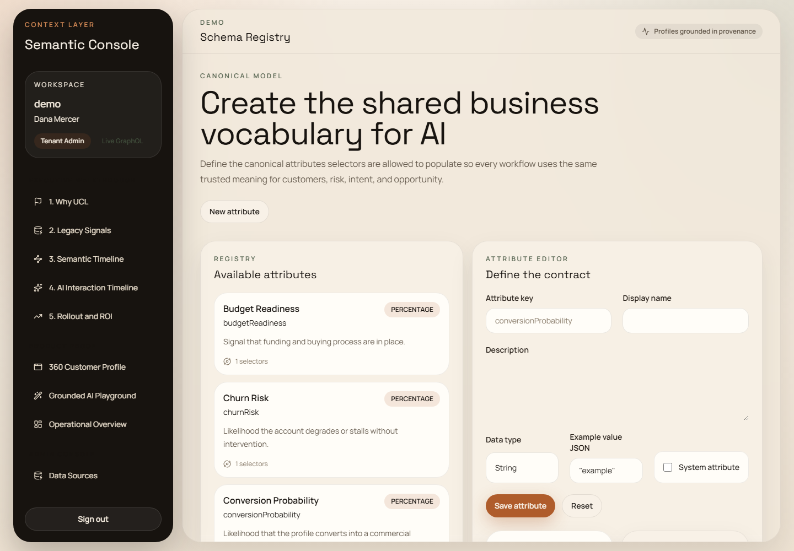 | 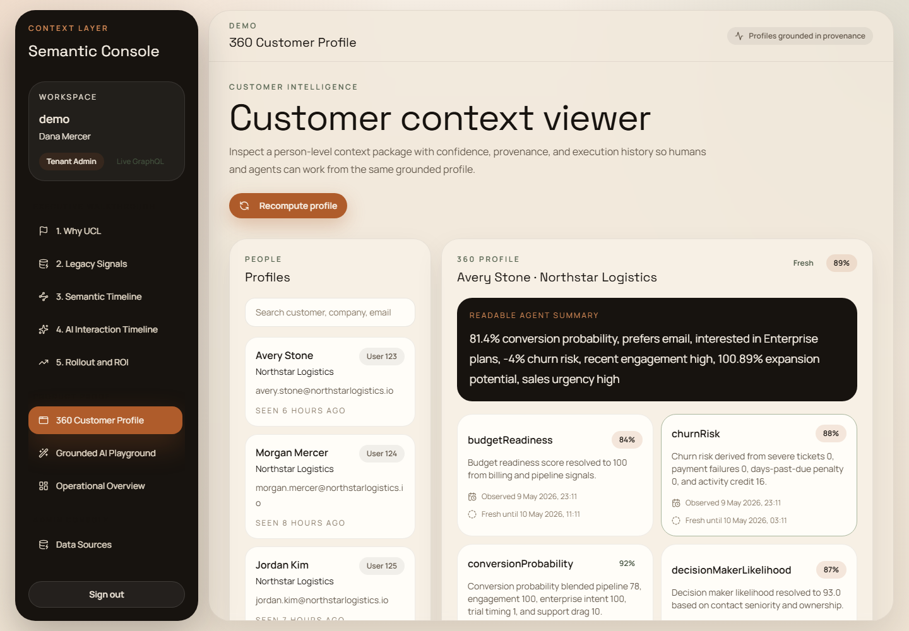 |

| UCL event timeline | AI-assisted onboarding |
| --- | --- |
| 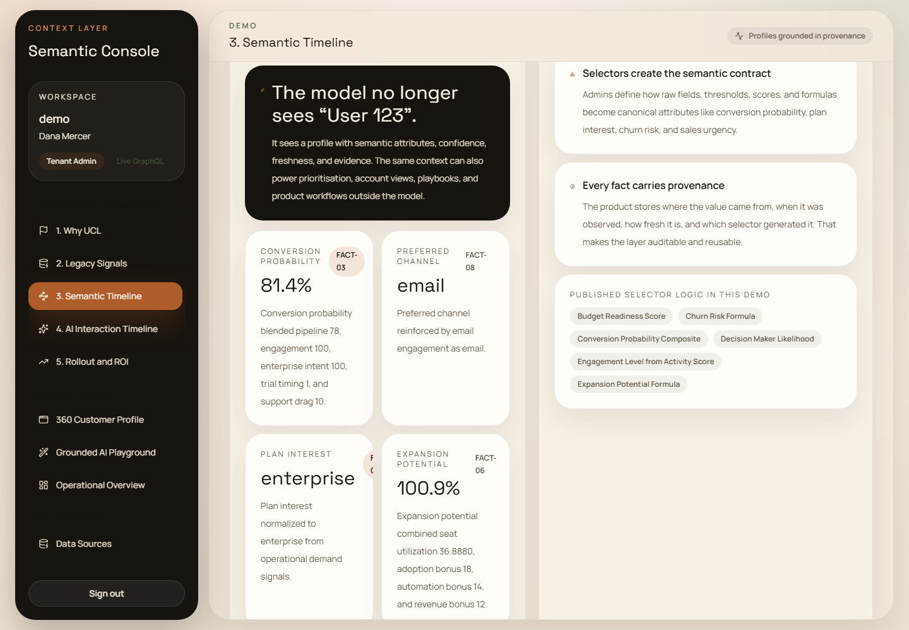 | 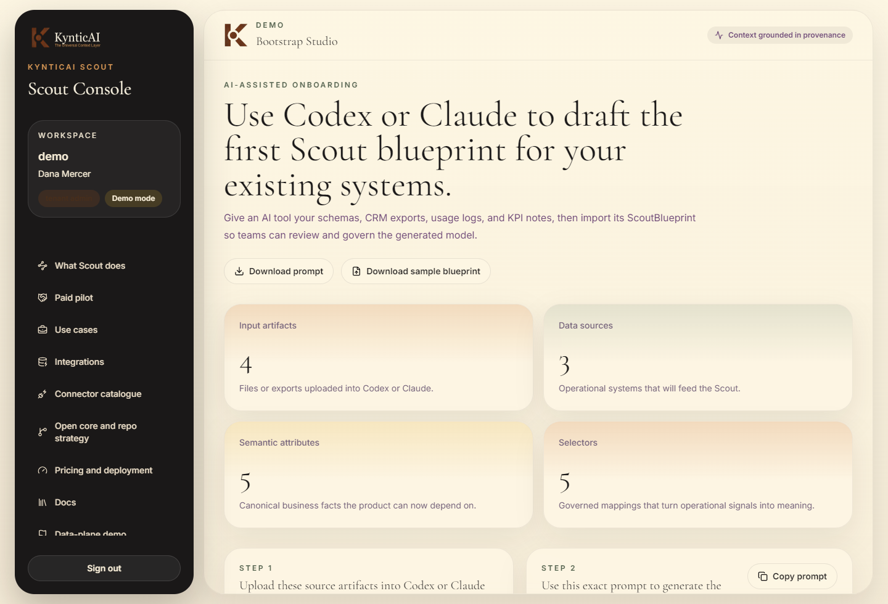 |

| Example consumer: Intelligent Sales Support | Audit log |
| --- | --- |
| 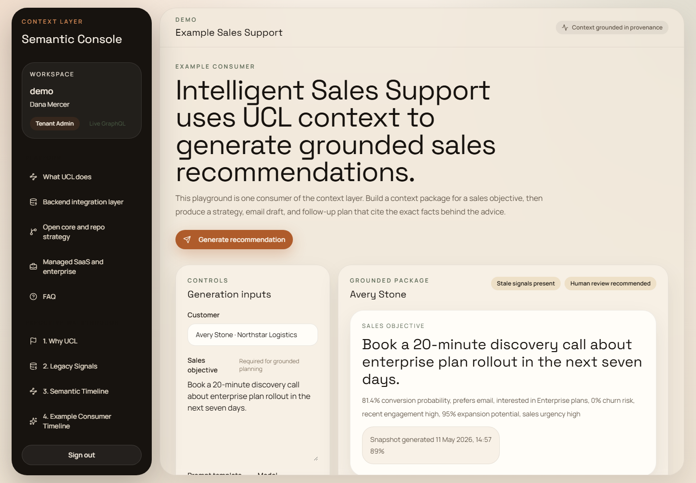 | 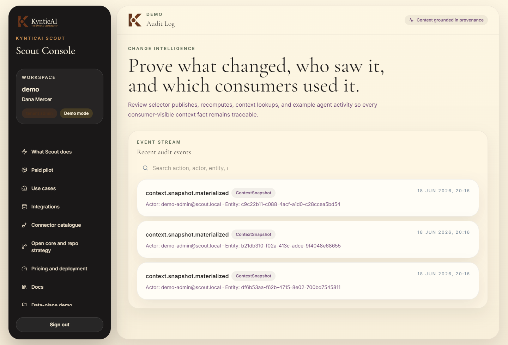 |

| Admin console: licence and updates |
| --- |
| 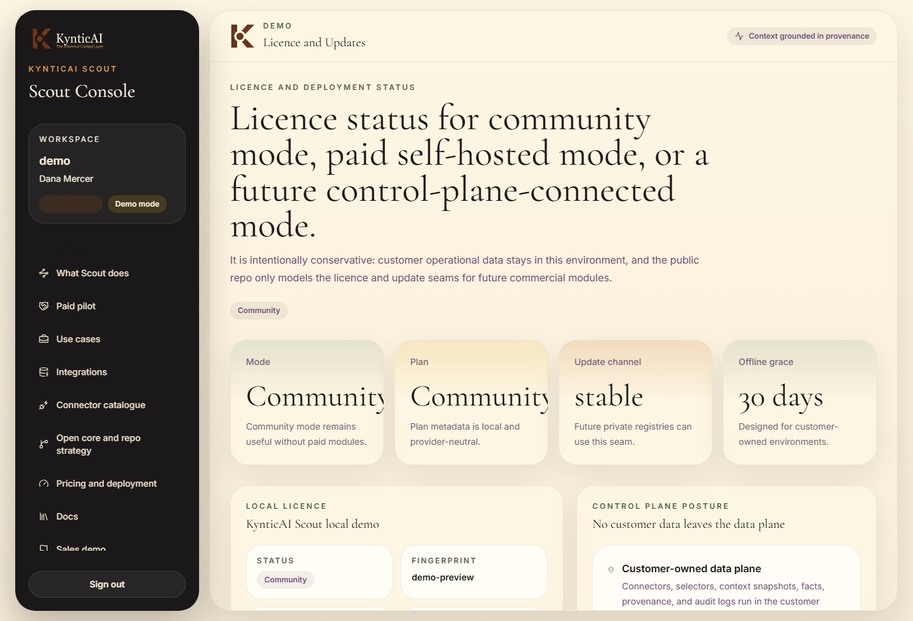 |

## Architecture At A Glance

- Frontend
  React 19, Vite, TypeScript, TanStack Router, TanStack Query, React Hook Form, Zod, Tailwind
- Backend
  ASP.NET Core .NET 10, Hot Chocolate GraphQL, EF Core, FluentValidation, OpenTelemetry
- Data layer
  Dual-database architecture with operational source data separated from semantic context data
- Context consumers
  GraphQL and REST APIs, TypeScript and .NET SDKs, governed context packages, confidence handling, provenance, masking, audit logging, and SaaS metadata for future delivery channels such as webhooks
- Future/private cloud control-plane foundations
  Tenant/workspace metadata, persisted API clients, plan and subscription metadata, connector installation records, context package metadata, billing usage records, onboarding state, feature flags, and PostgreSQL migrations. Hosted account management, live billing, commercial licence portals, download portals, update channels, support portals, and cloud operations live in paid/private cloud implementation work, not in this public repo.

Future/private cloud control-plane foundations are documented in [docs/saas-architecture.md](docs/saas-architecture.md), the connector catalogue skeleton is documented in [docs/connector-marketplace.md](docs/connector-marketplace.md), and billing/metering foundations are documented in [docs/billing-metering.md](docs/billing-metering.md). This public product repo keeps the customer data plane, demo, SDKs, REST and GraphQL APIs, and generic extension points working, but does not include paid enterprise connector implementations, payment provider integrations, hosted billing/control-plane code, or customer-specific integration code. Paid/private connector placeholders include CRM, warehouse, support, ERP, email, chat, calendar, product analytics, issue/project, and knowledge-system families; the public repo contains catalogue metadata and docs only for those vendors.

## Control Plane And Customer Data Plane

UCL v2 separates the product into a customer-owned data plane and an optional hosted control-plane relationship.

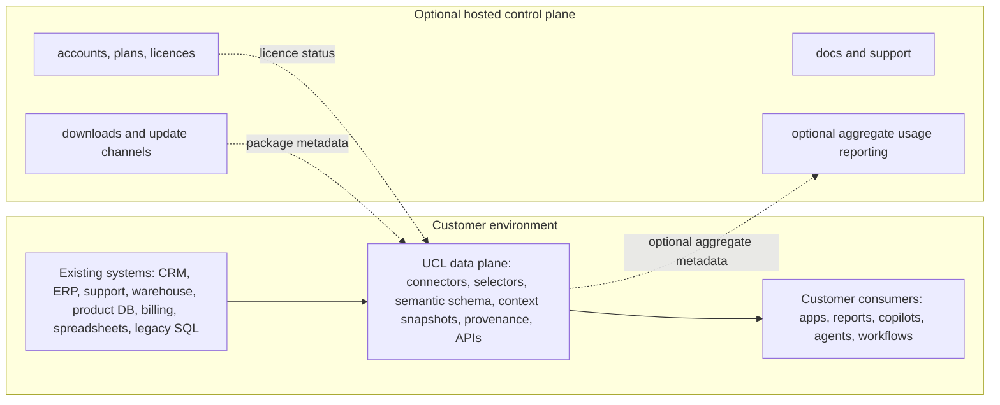

The self-hosted data plane manages source connectors, selector execution, semantic attributes, context snapshots, context facts, provenance, audit logs, GraphQL APIs, REST APIs, API keys, local users, and local roles. Customer operational data can remain in the customer's environment.

The hosted control plane, if used later, should manage accounts, plans, licences, downloads, documentation, support access, update channels, and optional aggregate usage reporting. It should not require raw customer records, context facts, connector credentials, or prompt context packages to leave the customer environment.

The split architecture is documented in [docs/control-plane-data-plane.md](docs/control-plane-data-plane.md).

## Runtime Modes And Feature Flags

The backend supports three explicit modes:

- `LocalDemo`
  Default local mode. Uses SQLite, fictional seed data, and the React demo.
- `BackendOnly`
  API-first mode for GraphQL, REST, SDK, and service-client work without relying on the React demo.
- `SaaS`
  Hosted control-plane-compatible mode for PostgreSQL deployments. In the public repo this enables foundational SaaS metadata, feature flags, and hosted deployment posture only; it does not include a paid hosted control-plane implementation.

Key flags live under `FeatureFlags`:

- `DemoExperience`
- `OpenCoreApis`
- `SaaSControlPlane`
- `HostedBillingUsage`
- `Webhooks`
- `EnterpriseConnectorExtensions`

Licence and control-plane settings live under `Licence` and `ControlPlane`. Community mode is the default. A local licence file can be loaded for paid self-hosted deployments later, and `/admin/licence`, `/api/v1/licence/status`, and GraphQL `licenceStatus` expose the current state. The public repo does not phone home or unlock paid enterprise connector code.

Use `/api/platform/config` to inspect the effective mode and enabled feature flags at runtime.

## Seeded Demo Story

The bootstrap seeds a realistic B2B SaaS sales environment with:

- 2 tenants
- 30 accounts
- 80 contacts and product users
- 50 opportunities
- 200 sales activities
- 560 product usage rows
- 100 support tickets
- 100+ email engagement events
- 120 billing records
- 120 conversion and lifecycle events

Five accounts are deeply fleshed out:

- `Larkspur Logistics Group`
- `Brindle Care Network`
- `Quartz Legal Systems`
- `Emberforge Robotics`
- `Willowbank Finance Group`

The strongest walkthrough record is:

- `demo` tenant
- `User 123`
- `Avery Stone`
- `Larkspur Logistics Group`

That record resolves into semantic attributes such as:

- `conversionProbability`
- `preferredChannel`
- `planInterest`
- `engagementLevel`
- `churnRisk`
- `expansionPotential`
- `budgetReadiness`
- `decisionMakerLikelihood`
- `productFit`
- `recommendedSalesMotion`

The data is internally consistent on purpose. For example:

- high product usage and feature adoption increase expansion potential
- repeated pricing-page visits increase enterprise plan interest
- strong email engagement reinforces preferred outreach channel
- open support issues can weaken confidence or increase review flags
- billing and opportunity signals affect budget readiness and urgency

## Static GitHub Pages Demo

The repository includes a backend-free static demo that can be published to GitHub Pages from `apps/web/dist-static-demo`. It is a brochure, sales, and marketing walkthrough using the same professional brand direction as the React site, with fixed fictional snapshots instead of live API calls, databases, Docker, or setup scripts.

The static demo tells the five-minute product story: fragmented operational data, selectors, semantic facts, customer data plane, API/context package consumption, workflow or AI usefulness, and why legacy systems can stay in place.

The full downloadable product still lives in this repo as the functional React application, backend, APIs, SDKs, selector engine, seeded demo, and local setup path.

Live static demo: [https://pauljmaddison.github.io/universalcontextlayer/](https://pauljmaddison.github.io/universalcontextlayer/)

Build it from `apps/web` with:

```powershell
npm run build:static-demo
```

Preview it locally with:

```powershell
npm run preview:static-demo
```

See [docs/static-github-pages-demo.md](docs/static-github-pages-demo.md) for the publishing workflow, included fixture data, and limitations.

## Fresh Laptop Quick Start

The default demo path is designed for a clean Windows or macOS/Linux laptop. You do not need Docker, PostgreSQL, a global .NET SDK, or a global Node.js install for the standard local demo.

The setup scripts will download repo-local runtimes when needed:

- `.dotnet/` for the .NET 10 SDK
- `.node/` for Node.js and npm
- `.demo-data/` for the two SQLite demo databases
- `.demo-runtime/` for process IDs, logs, and temporary bootstrap files

Those folders are ignored by Git and can be recreated at any time.

### 1. Clone the repository

```powershell
git clone https://github.com/PaulJMaddison/universalcontextlayer.git
cd universalcontextlayer
```

```bash
git clone https://github.com/PaulJMaddison/universalcontextlayer.git
cd universalcontextlayer
```

### 2. Set up and seed the demo

### Windows

```powershell
./scripts/setup-demo.ps1
```

### macOS / Linux

```bash
sh ./scripts/setup-demo.sh
```

The setup command:

1. checks for compatible local tooling
2. downloads repo-local .NET 10 and Node.js if needed
3. creates `.env` and `apps/web/.env.local` if missing
4. creates the local SQLite database directory
5. provisions the operational source database
6. provisions the semantic context database
7. seeds the public demo data
8. restores backend tools and dependencies
9. installs frontend dependencies
10. prints URLs, credentials, and sample users

### 3. Start the product

```powershell
./scripts/start-demo.ps1
```

```bash
sh ./scripts/start-demo.sh
```

The start command:

- reseeds the demo if needed
- starts the ASP.NET Core API on `http://127.0.0.1:5198`
- verifies the health endpoint
- verifies login with the seeded admin account
- verifies GraphQL can resolve `User 123`
- starts the Vite web app on `http://127.0.0.1:5173`

### 4. Open the browser

Open:

- [http://127.0.0.1:5173](http://127.0.0.1:5173)

Or use the helper:

```powershell
./scripts/open-demo-browser.ps1
```

Demo login:

- `demo` / `admin@contextlayer.local` / `DemoAdmin123!`
- `demo` / `rep@contextlayer.local` / `DemoSales123!`

## Local Database Modes

### Default local mode

By default, the scripts use two local SQLite databases so the demo downloads and runs on almost any laptop without requiring Docker or a database server:

- `.demo-data/customer_ops_demo.db`
- `.demo-data/context_layer_demo.db`

The product behavior stays the same: operational data remains separate from semantic context data, and the context layer still reads from the operational store and writes governed semantic facts into its own database.

### Optional PostgreSQL package mode

If you want the full Docker-backed package for demos or observability, you can still opt into PostgreSQL explicitly:

```powershell
./scripts/setup-demo.ps1 -UseDocker
./scripts/start-demo.ps1 -UseDocker
```

```bash
sh ./scripts/setup-demo.sh --use-docker
sh ./scripts/start-demo.sh --use-docker
```

That mode provisions:

- `customer_ops_db`
- `context_layer_db`

and brings up the optional observability services as part of the Docker stack.

Use Docker/PostgreSQL when you want to show the same product shape against named PostgreSQL databases. Use the default SQLite path when you want the least friction on a fresh demo laptop.

## Verified Local URLs

- Web app: [http://127.0.0.1:5173](http://127.0.0.1:5173)
- API base: [http://127.0.0.1:5198](http://127.0.0.1:5198)
- GraphQL endpoint: [http://127.0.0.1:5198/graphql](http://127.0.0.1:5198/graphql)
- Health endpoint: [http://127.0.0.1:5198/health](http://127.0.0.1:5198/health)

## Public Website Routes

The React application now does two jobs:

- it remains the seeded demo and admin console after login
- it also acts as the public product and learning site for the broader backend integration-layer vision

Public routes:

- `/platform`
  Explains what Universal Context Layer does, why semantic context matters, and how the same layer can support many consumers.
- `/integration-layer`
  Explains connectors, selectors, GraphQL, REST, SDKs, context packages, future webhook delivery, machine-to-machine usage, and backend-only operation.
- `/connectors`
  Shows the connector catalogue with executable open-core connectors, configuration and credential schemas, health-check expectations, and clear placeholder messaging for enterprise/vendor connectors.
- `/open-core`
  Explains the public repo boundary, future enterprise repo boundary, and why the open source core remains useful on its own.
- `/commercial`
  Explains future managed control-plane, private cloud, commercial support, and implementation options without pretending paid code lives in this repo.
- `/onboarding`
  Runs the local demo/private setup flow for a new company. It collects organisation details, tenant slug, primary workspace, first admin, current source systems, data categories, desired AI use cases, PII sensitivity, and deployment preference, then provisions a safe starter workspace.
- `/faq`
  Answers common buyer, CTO, developer, and architecture questions.

Authenticated routes still provide the seeded demo walkthrough, customer context viewer, admin console, selector builder, audit view, and Intelligent Sales Support example consumer.

## Demo And Private Setup Flow

Open [http://127.0.0.1:5173/onboarding](http://127.0.0.1:5173/onboarding) in local demo mode to try the company onboarding flow.

Anonymous onboarding is enabled only for local demo/development by default. In Production or `SaaS` mode it fails closed unless `FeatureFlags__AnonymousOnboarding=true` and `FeatureFlags__AllowProductionOnboarding=true` are deliberately set for a controlled private setup window.

The flow creates:

- a tenant and primary workspace
- the first tenant admin account
- safe mock starter data sources for the selected systems
- starter semantic attributes based on available data categories
- published starter selectors that show how source fields become semantic context
- onboarding state records and audit events
- next-step guidance for local demo, self-hosted, future hosted control-plane, or private cloud deployment

Onboarding deliberately does not store production connector credentials. It only creates mock connector placeholders and extension points so the private setup path remains safe and fictional.

The local/private setup REST endpoint is:

```bash
curl -X POST http://127.0.0.1:5198/api/onboarding \
  -H "Content-Type: application/json" \
  -d '{
    "organisationName": "Acme Revenue Systems",
    "tenantSlug": "acme-revenue",
    "primaryWorkspaceName": "Revenue workspace",
    "adminDisplayName": "Dana Mercer",
    "adminEmail": "dana@example.test",
    "adminPassword": "DemoPassword123!",
    "intendedUseCase": "Generate trusted account briefs for sales and support AI workflows.",
    "sourceSystems": ["Salesforce CRM", "Zendesk Support", "Snowflake Warehouse"],
    "dataCategories": ["CRM", "Support", "Warehouse"],
    "aiUseCases": ["Sales copilot", "Executive account briefs"],
    "piiSensitivityLevel": "moderate",
    "preferredDeploymentMode": "local-demo"
  }'
```

Authenticated platform or tenant admins can also call the `submitOnboarding` GraphQL mutation.

## Backend-Only Mode

The React app remains available as a separate demo experience under `apps/web`, but the API can now run on its own as a backend integration service.

Backend-only mode supports:

- GraphQL at `/graphql`
- REST endpoints for common integration workflows under `/api/rest`
- selector recomputation workers
- health endpoints at `/health`, `/health/live`, and `/health/ready`
- OpenAPI and Swagger UI at `/swagger`
- SQLite for local development
- PostgreSQL for production
- machine-to-machine token issuance at `/api/auth/token`
- demo seeding only when explicitly requested

### Backend-only quick start

Windows:

```powershell
./scripts/setup-backend.ps1
./scripts/start-backend.ps1
```

macOS / Linux:

```bash
sh ./scripts/setup-backend.sh
sh ./scripts/start-backend.sh
```

Optional seeded demo data:

```powershell
./scripts/setup-backend.ps1 -SeedDemoData
./scripts/start-backend.ps1 -SeedDemoData
```

```bash
sh ./scripts/setup-backend.sh --seed-demo-data
sh ./scripts/start-backend.sh --seed-demo-data
```

Optional PostgreSQL mode:

```powershell
./scripts/setup-backend.ps1 -UseDocker
./scripts/start-backend.ps1 -UseDocker
```

```bash
sh ./scripts/setup-backend.sh --use-docker
sh ./scripts/start-backend.sh --use-docker
```

### Key configuration flags

- `Platform__Mode=BackendOnly`
- `Platform__EnableGraphQl=true`
- `Platform__EnableRest=true`
- `Platform__EnableOpenApi=true`
- `Bootstrap__ApplyMigrationsOnStartup=true`
- `Bootstrap__SeedDemoData=false`
- `Database__Provider=Sqlite` for local files or `Database__Provider=Postgres` for PostgreSQL
- `ConnectionStrings__ContextLayer=...`
- `ConnectionStrings__CustomerOps=...`
- `Auth__MachineClients__0__ClientId=...`
- `Auth__MachineClients__0__ClientSecret=...`
- `Auth__MachineClients__0__TenantSlug=...`
- `Auth__MachineClients__0__Role=tenant_admin`
- `ConnectorBootstrap__Definitions__0__...` when you want to register connectors from environment-backed configuration at startup

Example machine client configuration:

```json
{
  "Auth": {
    "Issuer": "ContextLayer",
    "Audience": "ContextLayer.Api",
    "SigningKey": "replace-with-a-long-production-secret",
    "MachineClients": [
      {
        "ClientId": "crm-service",
        "ClientSecret": "replace-me",
        "TenantSlug": "acme",
        "DisplayName": "CRM Service Client",
        "Role": "tenant_admin",
        "Scopes": [ "context:read", "context:write" ]
      }
    ]
  }
}
```

### Example integration calls

Get a machine token:

```bash
curl -X POST http://127.0.0.1:5198/api/auth/token \
  -H "Content-Type: application/json" \
  -d '{
    "grantType": "client_credentials",
    "clientId": "crm-service",
    "clientSecret": "replace-me",
    "scope": "context:read context:write"
  }'
```

Read user context over REST:

```bash
curl "http://127.0.0.1:5198/api/v1/context/users/123?tenantSlug=demo" \
  -H "Authorization: Bearer <token>"
```

Queue recomputation:

```bash
curl -X POST "http://127.0.0.1:5198/api/v1/context/recompute?tenantSlug=demo" \
  -H "Authorization: Bearer <token>" \
  -H "Content-Type: application/json" \
  -d '{
    "externalUserId": "123",
    "triggeredBy": "crm-webhook"
  }'
```

Register a connector over REST:

```bash
curl -X POST http://127.0.0.1:5198/graphql \
  -H "Authorization: Bearer <token>" \
  -H "Content-Type: application/json" \
  -d '{
    "query": "mutation RegisterConnector($input: RegisterConnectorInput!) { registerConnector(input: $input) { dataSourceId connectorType status } }",
    "variables": {
      "input": {
        "tenantSlug": "demo",
        "name": "Billing REST Connector",
        "description": "Reads billing facts from the existing platform API.",
        "kind": "Crm",
        "connectorType": "restApi",
        "configurationJson": "{\"baseUrl\":\"https://billing.example.com\",\"resourcePath\":\"/accounts/{externalUserId}\"}",
        "credentialsJson": "{\"bearerToken\":\"replace-me\"}"
      }
    }
  }'
```

Run a GraphQL context lookup:

```bash
curl -X POST http://127.0.0.1:5198/graphql \
  -H "Authorization: Bearer <token>" \
  -H "Content-Type: application/json" \
  -d '{
    "query": "query { userContext(input: { tenantSlug: \"demo\", externalUserId: \"123\" }) { fullName companyName summary overallConfidence } }"
  }'
```

### Versioned REST API v1

Systems that do not want GraphQL can use the production-minded REST surface under `/api/v1`. The endpoints use the same application services as GraphQL, support JWT bearer tokens and persisted API clients, return `X-Request-Id` correlation IDs, and expose OpenAPI documentation through Swagger when `Platform__EnableOpenApi=true`.

Core endpoints:

- `GET /api/v1/health`
- `GET /api/v1/connectors/catalogue`
- `GET /api/v1/workspaces`
- `GET /api/v1/context/users/{externalUserId}`
- `GET /api/v1/context/accounts/{externalAccountId}`
- `GET /api/v1/context/users/{externalUserId}/facts`
- `GET /api/v1/context/accounts/{externalAccountId}/facts`
- `GET /api/v1/context/snapshots/{snapshotId}`
- `POST /api/v1/context/users/{externalUserId}/ai-safe-context-package`
- `POST /api/v1/context/recompute`
- `POST /api/v1/selectors/preview`
- `POST /api/v1/selectors/validate`
- `GET /api/v1/semantic-attributes`
- `GET /api/v1/audit-events`
- `GET /api/v1/billing/usage`
- `POST /api/v1/events/source-system`
- `POST /api/v1/blueprints/upload`
- `POST /api/v1/blueprints/validate`
- `POST /api/v1/blueprints/preview`
- `POST /api/v1/blueprints/import`
- `POST /api/v1/api-clients`
- `POST /api/v1/api-clients/{id}/rotate`
- `DELETE /api/v1/api-clients/{id}`

Pagination is available on list endpoints with `page` and `pageSize`. Filters include examples such as `status` on workspaces, `q` and `dataType` on semantic attributes, and `action`, `entityType`, `fromUtc`, and `toUtc` on audit events.

See [Public API Contract](docs/public-api-contract.md) for context lookup, account lookup, semantic fact lookup, context snapshot retrieval, recomputation, selector preview, selector validation, audit/provenance lookup, AI-safe context package retrieval, tenant/workspace scoping, machine-to-machine auth, error envelopes, pagination, GraphQL examples, and SDK examples.

List the connector catalogue:

```bash
curl "http://127.0.0.1:5198/api/v1/connectors/catalogue?page=1&pageSize=100"
```

Filter marketplace metadata:

```bash
curl "http://127.0.0.1:5198/api/v1/connectors/catalogue?availability=OpenCore"
curl "http://127.0.0.1:5198/api/v1/connectors/catalogue?q=salesforce"
```

The catalogue includes executable open-core connectors and contracts for SQL, PostgreSQL via the generic SQL connector alias, REST API, CSV upload, local mock CRM/billing/support, product telemetry events, and first-party conversion events. REST and GraphQL catalogue responses include `publicStatus` so consumers can distinguish `PublicGenericExample`, `PaidEnterpriseImplementation`, `PlannedConnector`, and `CustomerSpecificConnector`. SQL Server, Salesforce, HubSpot, Dynamics, Snowflake, BigQuery, Zendesk, NetSuite, billing-system, Microsoft 365 / Outlook, Gmail / Google Workspace, Slack, Microsoft Teams, Outlook Calendar, Google Calendar, Segment, Amplitude, Mixpanel, PostHog, Jira, Linear, Confluence, Notion, SharePoint, Google Drive, and legacy .NET web handlers are labelled as placeholders or paid/private entries only; their paid enterprise implementations are intentionally not included in this public repo.

Validate and preview an AI-generated UCL blueprint:

```bash
curl -X POST "http://127.0.0.1:5198/api/v1/blueprints/preview" \
  -H "Authorization: Bearer <tenant-admin-token>" \
  -H "Content-Type: application/json" \
  -d '{
    "tenantSlug": "demo",
    "blueprintJson": "{ \"version\": \"1.0\", \"name\": \"Example\", \"dataSources\": [], \"semanticAttributes\": [], \"selectors\": [] }"
  }'
```

Blueprint import supports upload, validation, preview, and apply modes. It can create data sources, semantic attributes, selector definitions, prompt templates, PII rules, and audit policies from user-supplied JSON. The product does not call external AI APIs; users generate the file in Codex, Claude, ChatGPT, or another tool and upload it. The JSON schema is published at [docs/ucl-blueprint.schema.json](docs/ucl-blueprint.schema.json).

Create an API client with a tenant admin JWT:

```bash
curl -X POST "http://127.0.0.1:5198/api/v1/api-clients" \
  -H "Authorization: Bearer <tenant-admin-token>" \
  -H "Content-Type: application/json" \
  -H "X-Request-Id: docs-create-client-001" \
  -d '{
    "displayName": "Warehouse ingestion client",
    "workspaceSlug": "default",
    "scopes": ["context:read", "context:write", "selectors:write", "events:ingest", "audit:read", "billing:read", "blueprints:write"]
  }'
```

The response shows `apiKey` once. Store it in your secret manager; UCL only stores its hash.

API clients use the canonical scope contract documented in [docs/api-scopes.md](docs/api-scopes.md): `context:read`, `context:write`, `selectors:read`, `selectors:write`, `events:ingest`, `audit:read`, `admin:manage`, `blueprints:write`, and `billing:read`. `context:write` is official, not an accidental extra scope. Older dot-form scopes are accepted as aliases for compatibility, but new integrations should use only the colon names they need.

Call REST v1 with API-key authentication:

```bash
curl "http://127.0.0.1:5198/api/v1/context/users/123" \
  -H "X-API-Client-Id: <clientId>" \
  -H "X-API-Key: <apiKey>" \
  -H "X-Request-Id: crm-context-read-123"
```

Read account context and semantic facts:

```bash
curl "http://127.0.0.1:5198/api/v1/context/accounts/acct-123?tenantSlug=demo" \
  -H "Authorization: Bearer <token>"

curl "http://127.0.0.1:5198/api/v1/context/users/123/facts?tenantSlug=demo&attributeKey=health&page=1&pageSize=25" \
  -H "Authorization: Bearer <token>"
```

Retrieve a context snapshot and an AI-safe context package without UCL calling an AI model:

```bash
curl "http://127.0.0.1:5198/api/v1/context/snapshots/<snapshot-id>?tenantSlug=demo" \
  -H "Authorization: Bearer <token>"

curl -X POST "http://127.0.0.1:5198/api/v1/context/users/123/ai-safe-context-package?tenantSlug=demo" \
  -H "Authorization: Bearer <token>" \
  -H "Content-Type: application/json" \
  -d '{
    "objective": "Prepare a renewal-risk brief for the account team."
  }'
```

List semantic attributes with pagination and filtering:

```bash
curl "http://127.0.0.1:5198/api/v1/semantic-attributes?q=health&page=1&pageSize=25" \
  -H "Authorization: Bearer <token-or-api-key-token>"
```

Fetch current plan limits and usage with a tenant admin JWT:

```bash
curl "http://127.0.0.1:5198/api/v1/billing/usage?tenantSlug=demo" \
  -H "Authorization: Bearer <tenant-admin-token>"
```

Ingest a source-system event:

```bash
curl -X POST "http://127.0.0.1:5198/api/v1/events/source-system" \
  -H "X-API-Client-Id: <clientId>" \
  -H "X-API-Key: <apiKey>" \
  -H "X-UCL-Webhook-Timestamp: 2026-05-11T15:45:00.0000000Z" \
  -H "X-UCL-Webhook-Signature: sha256=<hmac-of-timestamp-dot-body>" \
  -H "Content-Type: application/json" \
  -d '{
    "eventId": "warehouse_evt_10001",
    "workspaceSlug": "default",
    "sourceSystem": "warehouse",
    "eventType": "account.updated",
    "externalUserId": "123",
    "externalAccountId": "acct-123",
    "payload": {
      "health": "green",
      "observedBy": "warehouse-sync"
    }
  }'
```

Webhook event ingestion supports signature validation, idempotency by event ID, tenant/workspace routing, event storage, selector trigger matching, recomputation job creation, dead-letter records, audit events, and GraphQL event-history inspection. See [docs/webhook-events.md](docs/webhook-events.md) for the provider-neutral contract and JSON examples for `customer.created`, `customer.updated`, `account.updated`, `opportunity.stage_changed`, `product_usage.updated`, `support_ticket.created`, `billing.payment_failed`, `email.engaged`, `lifecycle.converted`, and `source_record.deleted`.

The TypeScript and .NET SDKs wrap filtered semantic fact lookup and the same source-system event endpoint. This is enough for a customer-owned app, report, workflow, or AI tool to consume context or notify UCL about approved source changes without UCL becoming the AI model or a vendor data lake.

Errors use a consistent shape:

```json
{
  "error": {
    "code": "context.user_not_found",
    "message": "User context was not found.",
    "correlationId": "crm-context-read-123"
  }
}
```

### Hosted PostgreSQL Deployment

The first production-like deployment shape for this private product foundation is:

- React frontend as a static site built from `apps/web`
- ASP.NET Core backend as a Docker web service from `src/ContextLayer.Api/Dockerfile`
- PostgreSQL as managed databases for both `ContextLayerDbContext` and `CustomerOpsDbContext`
- SQLite only for the local demo mode

Use [render.yaml](render.yaml) for a Render Blueprint or follow [docs/hosted-deployment.md](docs/hosted-deployment.md) for manual deployment, environment variables, health checks, migration commands, seed rules, logging, OpenTelemetry, CORS, JWT settings, rate limits, backup, and restore.

This is not the full future managed control plane. It is the backend running in a hosted environment with PostgreSQL, secure configuration, and customer-owned data-plane responsibilities preserved.

Hosted production should set:

```text
ASPNETCORE_ENVIRONMENT=Production
Platform__Mode=SaaS
Database__Provider=Postgres
Bootstrap__ApplyMigrationsOnStartup=false
Bootstrap__SeedDemoData=false
ConnectionStrings__ContextLayer=<managed PostgreSQL connection string>
ConnectionStrings__CustomerOps=<managed PostgreSQL connection string>
Auth__SigningKey=<48+ byte random secret>
Cors__AllowedOrigins__0=https://<frontend-domain>
SaaS__PublicBaseUrl=https://<api-domain>
ControlPlane__Enabled=false
Licence__Mode=Community
Licence__FilePath=/var/lib/ucl/licence.json
DataProtection__KeyRingPath=/var/lib/ucl/data-protection-keys
DataProtection__RequirePersistentKeys=true
```

Run hosted database migrations before starting the new web service:

```powershell
docker run --rm `
  -e ASPNETCORE_ENVIRONMENT=Production `
  -e Platform__Mode=SaaS `
  -e Database__Provider=Postgres `
  -e Bootstrap__ApplyMigrationsOnStartup=true `
  -e Bootstrap__SeedDemoData=false `
  -e ConnectionStrings__ContextLayer="<managed PostgreSQL connection string>" `
  -e ConnectionStrings__CustomerOps="<managed PostgreSQL connection string>" `
  -e Auth__SigningKey="<48+ byte random secret>" `
  -e DataProtection__KeyRingPath="/var/lib/ucl/data-protection-keys" `
  -e DataProtection__RequirePersistentKeys=true `
  -v ucl-data-protection-keys:/var/lib/ucl/data-protection-keys `
  contextlayer-api migrate
```

Demo seeding is only for local demo mode:

```powershell
.\scripts\setup-demo.ps1
```

### Docker deployment

The API Docker image is defined in `src/ContextLayer.Api/Dockerfile`. Build and run it with local backend-only defaults:

```powershell
docker build -f src/ContextLayer.Api/Dockerfile -t contextlayer-api .
docker run --rm -p 8080:8080 `
  -e Platform__Mode=BackendOnly `
  -e Bootstrap__ApplyMigrationsOnStartup=true `
  -e Bootstrap__SeedDemoData=false `
  -e Database__Provider=Postgres `
  -e ConnectionStrings__ContextLayer="Host=host.docker.internal;Database=context_layer_db;Username=postgres;Password=postgres" `
  -e ConnectionStrings__CustomerOps="Host=host.docker.internal;Database=customer_ops_db;Username=postgres;Password=postgres" `
  -e Auth__Issuer=ContextLayer `
  -e Auth__Audience=ContextLayer.Api `
  -e Auth__SigningKey=replace-with-a-long-production-secret `
  -e DataProtection__KeyRingPath=/var/lib/ucl/data-protection-keys `
  -e DataProtection__RequirePersistentKeys=true `
  -v ucl-data-protection-keys:/var/lib/ucl/data-protection-keys `
  contextlayer-api
```

Once running, open:

- [http://127.0.0.1:5198/swagger](http://127.0.0.1:5198/swagger) for REST docs in local script mode
- [http://127.0.0.1:8080/swagger](http://127.0.0.1:8080/swagger) for the container default
- [http://127.0.0.1:8080/health](http://127.0.0.1:8080/health)

Optional observability services are available when the Docker stack is active:

- Grafana: `http://localhost:3000`
- Prometheus: `http://localhost:9090`
- Tempo: `http://localhost:3200`

## Demo Credentials

- `demo` / `admin@contextlayer.local` / `DemoAdmin123!`
- `demo` / `rep@contextlayer.local` / `DemoSales123!`
- `summit` / `admin@summit.contextlayer.local` / `SummitAdmin123!`
- `summit` / `rep@summit.contextlayer.local` / `SummitSales123!`

## Best Demo Records

- `demo` / `123` / `Avery Stone` / `Larkspur Logistics Group`
- `demo` / `126` / `Priya Nwosu` / `Brindle Care Network`
- `demo` / `129` / `Marcus Bell` / `Quartz Legal Systems`
- `summit` / `132` / `Elena Petrov` / `Emberforge Robotics`
- `summit` / `135` / `Calvin Reese` / `Willowbank Finance Group`

## Recommended Walkthrough

Start with the seeded admin account.

1. Open `Executive Demo` or `/demo`
   Lead with the story: operational systems remain in place, UCL creates semantic meaning, and many downstream systems can consume the governed context.
2. Step through `Legacy Signals`, `Semantic Timeline`, `Example Consumer Timeline`, and `Rollout and ROI`
   Use these pages as the narrative spine for decision-makers who need to understand business value, technical rollout, and governance.
3. Open `Customer Context` for `User 123`
   Show the readable summary, semantic facts, confidence badges, snapshot history, and the UCL interpretation timeline.
4. Open `Bootstrap Studio`
   Show how Codex, Claude, ChatGPT, or another AI tool can analyse customer schemas, CRM samples, KPI notes, and support exports to produce a governed import blueprint. The backend validates, previews, stores, audits, and imports that JSON without calling external AI APIs.
5. Open `Selector Builder`
   Preview `Preferred Channel from Contact Preference` to show how admin-authored logic turns raw source data into a canonical attribute.
6. Open `Example Consumer: Intelligent Sales Support`
   Generate the grounded outreach strategy and show the cited facts driving the recommendation. Frame this as one consumer of the context layer, not the whole product.
7. Open `Audit Log`
   Close with governance: reads, recomputes, and context access are traceable.

## How The Product Works End To End

1. Operational data lands in `customer_ops_db`.
2. Data sources expose those signals to the selector engine.
3. Selectors apply direct field mappings, thresholds, weighted scoring, formulas, enum normalisation, and conflict resolution.
4. Selector executions persist raw payloads, validation results, confidence, freshness, and provenance.
5. Canonical context facts are written into `context_layer_db`.
6. Context snapshots assemble those facts into reusable business profiles.
7. Consumers request context through GraphQL, REST, SDKs, internal services, or governed context packages.
8. One demo consumer, Intelligent Sales Support, builds a grounded context package for the selected user and sales objective.
9. The configured model returns structured JSON for:
   - outreach strategy
   - personalised email draft
   - follow-up recommendations
10. The UI shows exactly why the recommendation exists, including citations and low-confidence warnings.

Other consumers could use the same context to prioritise support, enrich a CRM account page, trigger onboarding workflows, personalise marketing, feed dashboards, update customer success health scoring, or guide a third party agent.

## Open Source Use

This repository is released under the [MIT License](LICENSE). That means other teams can use, study, modify, and extend the project freely, including for commercial evaluation and internal product development.

If you build on top of Context Layer, please keep the license notice intact and document any meaningful architectural changes for future contributors.

## Commercial Model

Universal Context Layer is developed as an open core context infrastructure product.

The code in this public repository is the open source core and is free to use under the current licence. It is intended to be useful in its own right for learning, local demos, self-hosting, prototyping, technical evaluation, and community experimentation.

The aim is not to publish a crippled teaser. The open source core is designed to remain a real, working foundation of the product: teams should be able to understand the architecture, run it locally, explore the APIs and SDKs, test integration patterns, and build context consumers on top of it without needing paid features first.

Alongside the open source core, paid offerings may be available for organisations that want faster deployment, deeper integration, or additional operational assurances. These offerings may include implementation-led paid pilots, private cloud deployment, on premise deployment, private enterprise connectors, SSO, advanced governance features, compliance reporting, SLAs, and future/private cloud control-plane support.

The public repository does not include paid enterprise connector implementations, hosted SaaS control-plane implementation, billing-provider integration, customer-specific mappings, or private deployment packs. Where the open source core exposes extension points for connectors, authentication, governance, or deployment, those interfaces are intended to allow commercial modules to plug in later without changing the public core.

The open source core should still remain useful without those paid features. It should be possible to learn from it, run it, extend it, and validate whether the overall approach fits your environment before deciding whether you need commercial help.

For the boundary and extension model, see [docs/open-core-boundary.md](docs/open-core-boundary.md), [docs/enterprise-extension-points.md](docs/enterprise-extension-points.md), and [docs/roadmap.md](docs/roadmap.md).

### Licence Modes

- `Community mode`
  The default public repo mode. It supports local demos, self-hosting, GraphQL, REST, SDK scaffolds, generic connectors, mock connectors, blueprint import, audit, provenance, and admin-console exploration without a paid licence.
- `Paid self-hosted mode`
  A future commercial mode where a customer installs a local licence file and may receive private modules through a private package feed or container registry. The public repo includes the local licence status seam, but not commercial licence signing or paid modules.
- `Future/private cloud control-plane mode`
  A future hosted control-plane model for accounts, licences, downloads, documentation, support access, update channels, and optional aggregate usage reporting. Raw operational data and connector credentials should still stay in the customer data plane unless the customer explicitly chooses a managed data-plane deployment.

## Paid Enterprise Options

The core product in this repository is MIT-licensed and open source. Paid enterprise options are intended for teams that want commercial support, managed deployment, or faster rollout into production environments.

- `Future/private cloud control plane`
  A future managed option for teams that want account management, updates, support, and operational help without owning every platform concern. The public repo does not include this hosted control-plane implementation.
- `Private cloud / single-tenant deployment`
  Enterprise deployment in a customer-controlled cloud or VPC with stronger isolation, regional hosting choices, identity integration, and governance controls.
- `On-prem / hybrid deployment`
  A commercial option for companies with legacy databases, regulated workloads, or network constraints that make a shared hosted model impractical.
- `Connector and selector accelerator`
  Paid delivery for custom connectors, source mappings, selector packs, semantic schema design, and production-ready context models for a specific customer estate.
- `AI rollout advisory`
  Workshops and implementation support covering context package design, bring your own AI integration, governance, business KPI alignment, and how to wire the semantic layer into real product workflows.
- `Enterprise support and SLA`
  Named support, onboarding, troubleshooting help, release guidance, and response expectations for business-critical deployments.

### Commercial Contact

- Businesses that want support with commercial deployment, enterprise integration, or implementation planning are welcome to contact the maintainer.
- `Email:` [paul.maddison.delimeg@gmail.com](mailto:paul.maddison.delimeg@gmail.com)
- `Phone:` [+44 7742 031553](tel:+447742031553)

## Example GraphQL Queries

More examples live in [samples/graphql/demo-queries.graphql](samples/graphql/demo-queries.graphql).

### User context lookup

```graphql
query DemoContextViewer {
  userContext(input: { tenantSlug: "demo", externalUserId: "123" }) {
    fullName
    companyName
    summary
    overallConfidence
    sourceSummary {
      accountName
      activePlanName
      pricingPageVisits30d
    }
    facts {
      attributeKey
      confidence
      explanation
    }
  }
}
```

### Example consumer context package

```graphql
query DemoSalesContextPackage {
  salesContextPackage(
    input: {
      tenantSlug: "demo"
      externalUserId: "123"
      salesObjective: "Book a 20-minute discovery call for enterprise rollout next week."
    }
  ) {
    summary
    overallConfidence
    humanReviewRecommended
    facts {
      citationId
      displayName
      confidence
      explanation
    }
  }
}
```

## Restart And Reset

### Restart

```powershell
./scripts/start-demo.ps1
```

```bash
sh ./scripts/start-demo.sh
```

### Reset and reseed

```powershell
./scripts/reset-demo.ps1
```

```bash
sh ./scripts/reset-demo.sh
```

Useful reset options:

- `-SkipRecreate` or `--skip-recreate` to stop without reseeding
- `-KeepVolumes` or `--keep-volumes` to preserve Docker volumes and local `.demo-data` database files

What reset removes by default:

- running API and web demo processes tracked in `.demo-runtime`
- local SQLite database files in `.demo-data`
- Docker containers and volumes when Docker is available

Then it runs setup again and reseeds the demo.

## Testing

The setup scripts install repo-local .NET and Node where needed. On a fresh Windows machine, run setup first, then use the repo-local .NET binary for backend tests:

```powershell
./scripts/setup-demo.ps1
./.dotnet/dotnet.exe test tests/ContextLayer.UnitTests/ContextLayer.UnitTests.csproj --no-restore
./.dotnet/dotnet.exe test tests/ContextLayer.IntegrationTests/ContextLayer.IntegrationTests.csproj --no-restore
```

Frontend checks can then be run from the repository root. If Node.js was installed repo-locally by the setup script, add it to the current terminal first:

```powershell
$nodePath = ./scripts/ensure-node.ps1 -RepoRoot $PWD
$env:PATH = "$nodePath;$env:PATH"
npm run lint --prefix apps/web
npm test --prefix apps/web
npm run test:e2e --prefix apps/web
npm run build --prefix apps/web
```

On macOS/Linux:

```bash
NODE_PATH_DIR="$(sh ./scripts/ensure-node.sh "$PWD")"
export PATH="$NODE_PATH_DIR:$PATH"
npm run lint --prefix apps/web
npm test --prefix apps/web
npm run test:e2e --prefix apps/web
npm run build --prefix apps/web
```

The automated coverage includes:

- backend unit tests for selector logic and example consumer output validation
- integration tests for dual-database connectivity, selector execution, context snapshot generation, GraphQL context lookup, and grounded example consumer output
- frontend component tests
- frontend end-to-end flows for selector preview and outreach recommendation generation
- responsive layout coverage for login, core admin routes, and mobile walkthrough surfaces

## Honest Demo Note

The seeded Intelligent Sales Support experience currently uses a deterministic mock structured provider so the demo is stable, grounded, and repeatable on any local machine. The orchestration layer, prompt templates, JSON schema validation, provenance, retry behaviour, and audit trail are all real. A live external provider can be swapped in, but UCL does not require customers to use this provider or this sales workflow.

## Architecture Note

The GraphQL-based semantic context layer is a strong fit for AI-enabled business systems because it gives downstream product features, workflows, reporting tools, copilots, and agents one stable contract over changing operational systems.

In a real customer environment, many source systems can feed one context platform:

- CRM
- support
- billing
- product telemetry
- warehouse tables
- marketing automation

GraphQL is one delivery interface because it lets each workflow request exactly the context shape it needs without forcing every consumer to understand every legacy schema. REST endpoints, SDKs, context packages, and future delivery channels such as webhooks can serve other integration styles. The selectors and semantic attributes can evolve independently of the operational systems, while masking, provenance, confidence, and audit stay centralised in one layer.

## ADR

The short architecture decision record is in [docs/adr/0001-graphql-semantic-context-layer.md](docs/adr/0001-graphql-semantic-context-layer.md).
