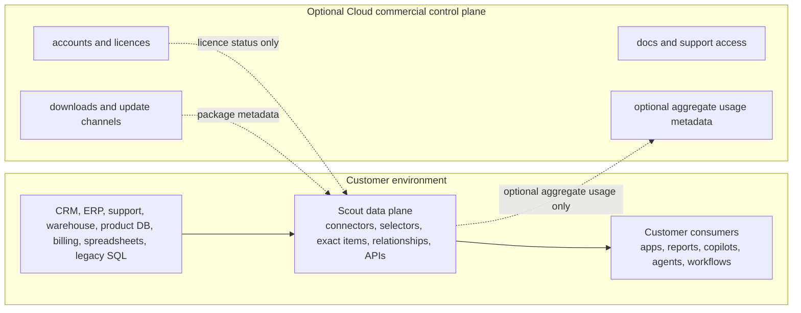

# Control Plane And Data Plane

KynticAI Scout is designed as context infrastructure with a customer-owned data plane and an optional hosted control-plane relationship.

The important rule is simple: operational customer data does not need to leave the customer environment for Scout to be useful.

## Customer Data Plane

The customer data plane is the self-hosted Scout runtime. It manages source connectors, connector credentials, customer-approved mappings, selector execution, semantic attributes, exact data items, exact linked records, relationships, attribution paths, outcomes, context snapshots, context facts, governed JSON packages, provenance, audit logs, GraphQL, REST, API keys, local users, local roles, and access to customer operational systems.

Typical data-plane components:

- ASP.NET Core Scout backend
- PostgreSQL in production or SQLite for the local demo
- customer connector configuration and credentials
- selector definitions and selector execution history
- semantic schema, exact data items, relationships, attribution paths, outcomes, context snapshots, context facts, governed JSON packages, and provenance
- audit events, source events, recompute jobs, and governance policies
- GraphQL, REST, SDK, and webhook/event ingestion endpoints

The public repository includes safe generic connectors, mock connectors, and paid/private connector placeholders only. Paid connector code, customer-specific mappings, advanced private analysis, and private deployment packs should live outside this repo.

## Cloud Commercial Control Plane

The Cloud commercial control plane is an optional commercial seam, not a requirement for the open-core product. It may manage accounts, subscriptions, licences, entitlements, private download metadata, update channels, support access, data-plane registration, deployment heartbeat metadata, and optional aggregate usage reporting.

Any optional commercial control-plane implementation lives outside this public repo. Scout open-core use must remain runnable without Cloud.

Canonical tier alignment:

| Public category | Scout-side meaning | Cloud-side role |
| --- | --- | --- |
| Scout | Public/open-core customer-owned data plane. | Optional registration, support/update metadata, and aggregate-only usage where configured. |
| Private runtime | Paid private extension runtime around Scout/UCL. | Subscription/licence entitlement, private download/update metadata, support, data-plane registration, and aggregate-only health/usage. |
| Assisted private tier | Operator-assisted strategic tier on top of the private runtime. | Operator/support metadata while raw outcomes remain in the customer data plane by default. |

Control-plane metadata should be limited to operational account information, licence state, package/update metadata, support access, entitlement metadata, and optional aggregate usage. It must not require raw CRM records, ERP records, support tickets, product usage, billing events, customer emails, chat messages, calendar descriptions, issue descriptions, documents, attachments, warehouse rows, analytics event payloads, local evidence-pack JSON, exact linked records, context facts, citations, weighted signals, recommendations, confidence, caveats, or per-entity relationship metadata to leave the customer environment.

See [Cloud Commercial Control Contract](cloud-commercial-control.md) for the Scout-side contract notes.

## Relationship JSON Boundary

When Scout generates next-action relationship JSON, the local customer data plane may use exact authorised data items such as normalised email address, CRM contact/account, account registration/profile, sales activity, opportunities, email replies, meetings booked, web conversion and pricing-page events, support tickets, product usage summaries, billing health, and won/lost outcome signals.

The customer data plane may build relationships, attribution paths, comparable relationship-set candidates, and local proof artefacts. Optional private extensions can add advanced analysis and return governed JSON for customer-owned apps, workflows, local LLMs, or agents.

The optional Cloud/control-plane payload for next-action usage is a Cloud aggregate usage payload only. It may carry tenant/control-plane identifiers, package version, feature usage counters, health/status, timestamps, and audit/control-plane event metadata. It must not carry raw records, context facts or snapshots, local evidence packs, prompts, generated content, recommendations, citation IDs, weighted signals, relationship type names, attribution paths, confidence, caveats, hashed subject/account identifiers, or per-entity relationship metadata.

## v2 Public Repo Foundations

The v2 public repo includes the first safe foundations:

- `ControlPlane` configuration for base URL, update channel, customer account ID, usage reporting flag, and offline grace period
- `Licence` configuration for community mode, local licence file path, paid-mode enforcement flag, and offline grace period
- `/api/platform/config` so operators can inspect runtime mode and feature flags
- `/api/v1/licence/status` and GraphQL `licenceStatus`
- a self-hosted admin console page at `/admin/licence`
- audit events for licence checks, invalid licences, and expired licences
- seeded local demo licence file generation in setup/start scripts

These foundations deliberately do not integrate a payment provider, phone home, or unlock private connector code.

## Mermaid View

## What Must Stay Local

- source records and raw payloads
- connector credentials
- selector source data
- exact linked records
- context facts and context snapshots
- provenance records
- local relationship JSON/evidence packs and prompt context packages that include customer data
- tenant audit logs unless the customer explicitly exports them

## Future Private Work

Future paid or private repositories may add advanced relationship-set analysis, attribution-path analysis, SSO, enterprise connectors, commercial licence signing, hosted account management, private cloud deployment packs, compliance reporting, support bundles, and SLA tooling. Those modules should plug into the public extension interfaces without turning the open-core repo into a crippled teaser.
