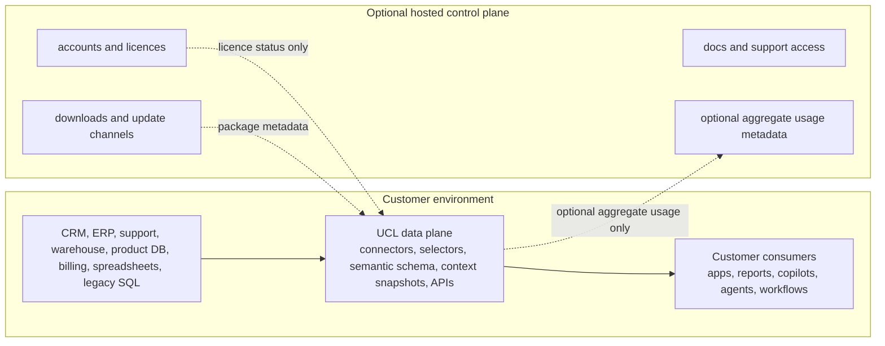

# Control Plane And Data Plane

Universal Context Layer is designed as context infrastructure with a customer-owned data plane and an optional hosted control-plane relationship.

The important rule is simple: operational customer data does not need to leave the customer environment for UCL to be useful.

## Customer Data Plane

The customer data plane is the self-hosted UCL runtime. It manages source connectors, selector execution, semantic attributes, context snapshots, context facts, provenance, audit logs, GraphQL, REST, API keys, local users, local roles, and access to customer operational systems.

Typical data-plane components:

- ASP.NET Core UCL backend
- PostgreSQL in production or SQLite for the local demo
- customer connector configuration and credentials
- selector definitions and selector execution history
- semantic schema, context snapshots, context facts, and provenance
- audit events, source events, recompute jobs, and governance policies
- GraphQL, REST, SDK, and webhook/event ingestion endpoints

The public repository includes safe generic connectors and mock connectors only. Paid enterprise connector code, customer-specific mappings, and private deployment packs should live outside this repo.

## Hosted Control Plane

The hosted control plane is a future commercial seam, not a requirement for the open-core product. It may manage accounts, plans, licences, downloads, documentation, support access, update channels, and optional aggregate usage reporting.

Paid/private cloud control-plane modules may also manage hosted account management, billing, commercial licence portals, download portals, support portals, and cloud operations. They are commercial implementations outside this public repo.

Control-plane metadata should be limited to operational account information and licensing state. It must not require raw CRM records, ERP records, support tickets, product usage, billing events, customer emails, warehouse rows, or context facts to leave the customer environment.

## v2 Public Repo Foundations

The v2 public repo includes the first safe foundations:

- `ControlPlane` configuration for base URL, update channel, customer account ID, usage reporting flag, and offline grace period
- `Licence` configuration for community mode, local licence file path, paid-mode enforcement flag, and offline grace period
- `/api/platform/config` so operators can inspect runtime mode and feature flags
- `/api/v1/licence/status` and GraphQL `licenceStatus`
- a self-hosted admin console page at `/admin/licence`
- audit events for licence checks, invalid licences, and expired licences
- seeded local demo licence file generation in setup/start scripts

These foundations deliberately do not integrate a payment provider, phone home, or unlock private connector code.

## Mermaid View

## What Must Stay Local

- source records and raw payloads
- connector credentials
- selector source data
- context facts and context snapshots
- provenance records
- prompt context packages that include customer data
- tenant audit logs unless the customer explicitly exports them

## Future Private Work

Future paid or private repositories may add SSO, enterprise connectors, commercial licence signing, hosted account management, private cloud deployment packs, compliance reporting, support bundles, and SLA tooling. Those modules should plug into the public extension interfaces without turning the open-core repo into a crippled teaser.
# Control Plane And Customer Data Plane

The public repository implements the customer-owned data-plane foundations. Source connectors, selector execution, semantic attributes, context snapshots, context facts, provenance, audit logs, REST, GraphQL, API keys, local users, local roles, and customer operational data remain in the customer environment by default.

Paid/private cloud control-plane modules may manage hosted account management, billing, commercial licences, downloads, update channels, support access, aggregate usage reporting, and cloud operations. They must not require raw customer operational records, connector credentials, context facts, or prompt packages to leave the customer data plane by default.
