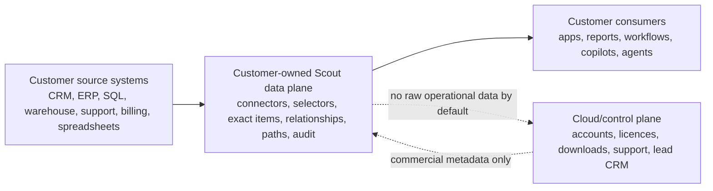

# Paid Pilot Proof Package

Use this package for fast buyer proof before a scoping call. It is designed to prove a real operational pattern without claiming self-serve SaaS or vendor-certified connector coverage.

Connector marketplace and n8n status should be taken from [Connector Catalogue](connector-marketplace.md) and [KynticAI n8n Node](n8n-node.md). The safe public position is: generic Scout connector proof is implemented, the n8n node is local-package partial, private connectors are scoped separately, and no public marketplace or published connector is claimed.

## Two-Minute Demo Video Script

1. Show the source data: a PostgreSQL or SQL table with customer, commercial, support, pricing, or operational fields.
2. Show the selector: source fields mapped into semantic attributes with confidence, freshness, and provenance.
3. Show context facts and relationships: the system stores evidence-rich facts and links rather than forcing the downstream workflow to inspect raw source records.
4. Show the context snapshot: one customer/account/workflow relationship/context JSON package created from those facts.
5. Show the API response: GraphQL or REST returns the snapshot and provenance trail.
6. Close with the customer-owned data-plane boundary: raw operational data, connector credentials, relationship/context packages, and derived intelligence stay in the customer environment by default; the hosted control plane manages commercial metadata only.

Keep the recording practical. Do not show secrets, production credentials, raw customer data, or internal commercial notes.

## One-Page PDF Content

Title: Turn existing business data into trusted context for AI workflows in 2-6 weeks.

Positioning:

- Scout sits beside CRM, ERP, SQL databases, warehouses, support, billing, product, spreadsheets, and internal workflow systems.
- It maps raw source fields into governed semantic facts that reports, apps, workflows, copilots, and agents can consume.
- The first paid pilot focuses on one high-value workflow and one customer-owned data plane.

Proof:

- verified generic SQL connector proof
- selector mapping with confidence, freshness, and provenance
- context fact output
- context snapshot output
- REST or GraphQL lookup response
- audit/provenance trail

Boundary:

- no raw operational data in the hosted control plane by default
- no unscoped vendor connector promises
- private connector modules are scoped and validated per customer/vendor environment

Commercial boundary:

- commercial scope is agreed privately after discovery
- public material should not publish private commercial terms
- pilot commitments must be tied to a named workflow, source boundary, security review, and support model
- enterprise rollout, managed operations, and private connector work require separate scoping

Recommended next step:

Book a pilot scope call with a named workflow, source systems, and buyer outcome.

## Customer-Owned Data Plane Diagram

## Screenshot Checklist

Capture these five screenshots from the local proof flow or a customer-approved representative dataset:

- source data rows
- selector mapping page or config
- context facts showing value, confidence, freshness, and provenance
- context snapshot output
- REST or GraphQL response with audit/provenance reference

Redact email addresses, names, customer identifiers, credentials, and any operational values not approved for sharing.

## Anonymised ERP Pattern

The case-style story is simple: an ERP platform kept existing operational systems in place, added a semantic layer beside them, and used that layer to power new web and AI-enabled workflows. Scout productises that pattern for repeatable delivery: source data in, selectors in the customer data plane, trusted context out.
